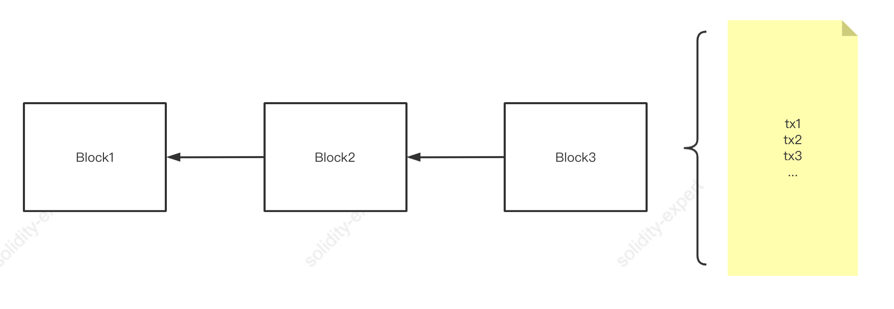
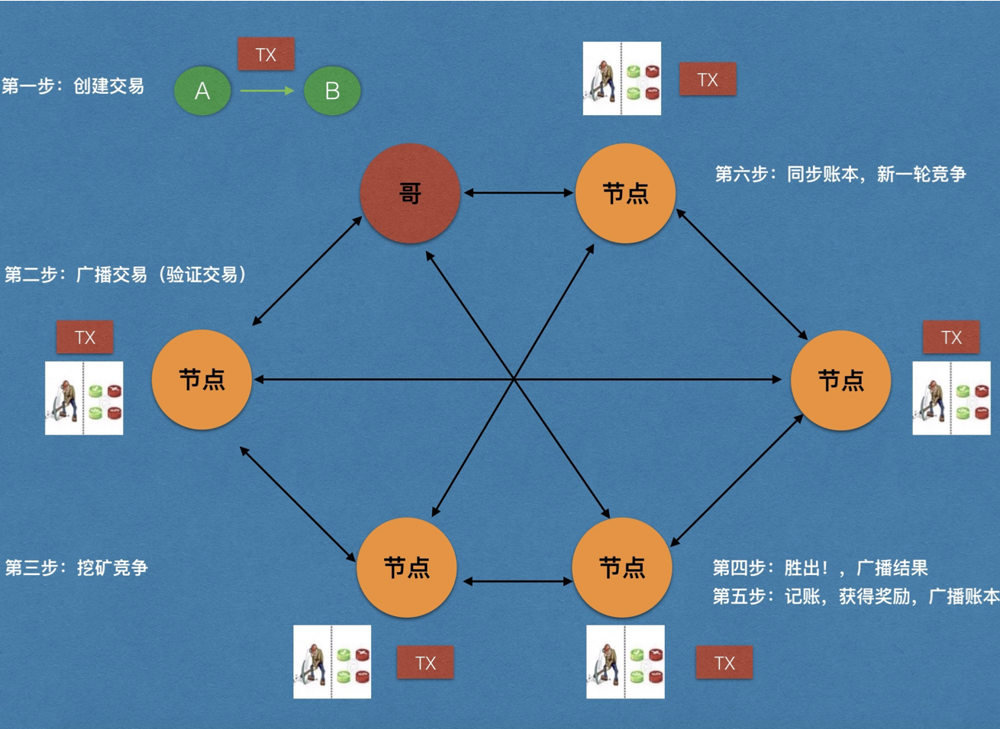

# 第1节：什么是区块链

>  本文收录于我的开源项目：https://github.com/dukedaily/solidity-expert，欢迎star转发，文末加V入群。

这是个好问题，但话题太大了，这是一个笼统的概念，网上描述的天花乱坠，我这里将其简化为几个概念，消化了就够入门了：

1. **交易**：在区块链世界里面，我们把所有的交互行为（买东西、投票、转账）统称为一个交易（Transaction，简写为Tx）
2. **区块**：在一个特定的时间段内（如10分钟）会产生N笔交易，我们把这些交易打包到一起之后，称之为区块（Block）
3. **区块链**：在更长的一段时间内（如60分钟）会产生很多区块，我们这些区块（Block）以特定的规则链接🔗到一起之后，就称之为区块链（Blockchain）

## 交易与区块关系图示

这张图描述的关系是所有区块链项目共同的概念，记住这张图就可以从最高层面了解区块链。

详细一点可以这样描述：(看不懂没关系，不影响后续！)

## 区块链规则

对于一个特定的区块链项目，其区块的产生、链接、同步方式、同步时间等是有特定的规则的，大体上可以用下面这张图来描述。

## 区块链项目

每当我们提到区块链项目，一般包含两个层面的意思：

1. 聚焦在区块链本身，这相当于操作系统层面的项目（如Mac和Windows），我们的教程聚焦于：以太坊（Ethereum）
2. 聚焦在应用层面，如微信，手机银行等，在区块链领域，我们称之为Dapp（Decentralized Application），即去中心化应用。

## 小结

区块链行业起始于比特币、兴于以太坊以及其后继者，随着行业发展，更多的项目也在陆续爆发（如solana，Aptos，sui等）。

各种基础建设（infrastructure）也在不断完善，如价格预言机[Chainlink](https://docs.chain.link/docs/conceptual-overview/)，开发框架[hardhat](https://hardhat.org/hardhat-network/docs/overview)，第三方服务[Moralis](https://moralis.io/)，[Tenderly](https://tenderly.co/)等，这些我在后面的章节中都会陆续讲到，敬请关注，加V入群：Adugii，下期见！

