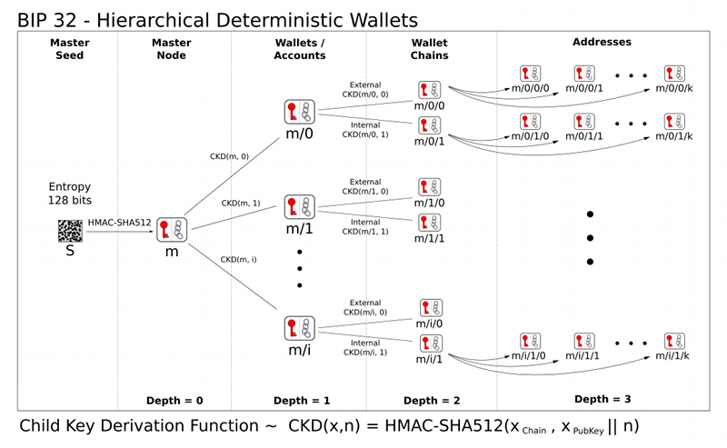

# 第7节：钱包与地址

普通人通往区块链世界最常用的入口就是`钱包`（Wallet），钱包顾名思义就是用来管钱的，在区块链世界里面的所有操作都离不开钱包，具体包括：收付款、与Dapp交互等。所以拥有一个自己的钱包是你在web3世界的万物之本。

本文偏理论，只要涉及概念包括：`钱包、地址、私钥、助记词`等，这些都是绕不开的，一定要理解消化。

## 常用钱包

web3中的钱包就是一个Dapp，它存在形式很多，包括手机应用（如：Imtoken、TokenPoket）或者浏览器插件（如：Metamask、connectWallet）等。

1. 前面两个Imtoken、TokenPoket一般是用于资产管理比较多，这部分请自行了解；
2. 后面两个**Metamask**、connectWallet一般用于Dapp开发比较多，我们专注在`Metamask`上，这个最简单，一通百通。

## Metamask

小狐狸插件是最常用的开发者钱包，点击在线安装Chrome插件：[点击下载](https://chrome.google.com/webstore/search/MetaMask?hl=zh-CN)，操作步骤：

1. **第一步创建钱包：**（1）开始使用-> （2）我同意-> （3）钱包

2. **创建密码、助记词：**

**第6步中的12个单词一定要记住牢，保存好，别存在网上，别给任何人看，否则你的钱包就会被掏空！！！！**

这12个单词叫做`助记词`，是钱包的超级管理员，`任何人持有了助记词，就会被认为是钱包的主人`（上图是测试助记词，任何人都不要使用哦）

至此，整个安装结束，最终效果如下（具体字段我们陆续介绍）：

## 什么是地址

上面我们提到了`地址`，在钱包中，地址的概念就类似于我们的银行卡号，地址可以收款、付款，一个钱包可以有多个地址，具体格式如下（不同的区块链项目，地址规则可能不同）：

- 以太坊地址格式：0xF8dE961c18Cc95dB192667717bdfF675748C1F37（40个16进制数）
- 比特币地址格式：[bc1qynxn0xxt8ljawc0hynjnqpl8a8vf5ykqttdd2m](https://www.blockchain.com/btc/address/bc1qynxn0xxt8ljawc0hynjnqpl8a8vf5ykqttdd2m)

把以太坊地址发送给对方，他就可以使用钱包直接给你转账了，下图是比特币钱包与私钥示意图，以太坊钱包原理也相同：

如果觉得复杂，这里你只需要记住，**一个私钥和一个地址一一绑定**，查看当前地址的私钥：点击三个点-> 账户详情-> 导出私钥（输入密码）->显示私钥

## 地址类型

地址一共分两种类型：

- 小狐狸这种的地址，一般叫做EOA：External Of Account，外部账户，由私钥控制
- 部署合约后生成的地址，一般叫做CA：Contract Account，合约地址，生成规则取决于：部署地址和当前的Nonce

两种账户的具体区别：

## 什么是私钥

私钥这是非对称加密中的概念，与公钥相对，根据256位的随机数（比宇宙原子还大的数，不用担心重复），我们可以得到私钥，其中：

- 私钥：是保密的，一般用于签名，证明你是资产的持有者；
- 公钥：是公开的，一般用于验证，证明私钥签名的数据是有效的。

在区块链中，私钥用来做签名，只有持有私钥的人才能支配资产，其他人使用地址（公钥的哈希）进行验证，如下图中：

- Alice使用私钥对信息进行签名后广播
- Bob和`黑人问号脸`持有公钥，都可以对Alice的信息进行校验

如果Alice持有的私钥是假的，那么她就没办法通过Bob的校验，交易就会被拒绝掉，Alice也就没办法支配那个地址的Token。

## 比特币地址生成规则

地址生成大致逻辑为：**随机数-> 私钥-> 公钥-> 公钥哈希-> 地址**

详细规则为：（了解即可）

## 以太坊地址生成规则

1. 生成 256 位随机数作为私钥。

2. 将私钥转化为 secp256k1 非压缩格式的公钥，即 512 位的公钥。

3. 使用散列算法 Keccak256 计算公钥的哈希值，转化为十六进制字符串。

4. 取十六进制字符串的后 40 个字母，开头加上 0x 作为地址。

## 助记词

我们知道私钥是可以管理地址的，但是私钥太难记了，是256位的0和1，因此后来有人提出了`助记词`的提议，从而有效的解决了私钥管理困难的问题。

还记得上面的12个单词么，它们就是`助记词`，即帮助你管理自己钱包的单词，助记词可以有多个单词（通常为12个），它们的：

- 作用：帮助用户来更加方便的记住自己的私钥，管理财产（一套助记词可以派生N个钱包地址，小狐狸上可以点创建钱包，会自动生成新地址）。
- 原理：将随机数通过特定编码转化为词库中的单词。

说穿了，助记词是随机数与单词的映射，使用助记词就可以恢复随机数，进而计算出私钥，管理资产。

## HD Wallet钱包

现在基本都是使用分层确定性钱包，也称 HD 钱包，演变历史为：BIP32 -> BIP39 -> BIP44，[点击在线体验](https://iancoleman.io/bip39/#english)

### **[BIP32：分层派生](https://github.com/bitcoin/bips/blob/master/bip-0032.mediawiki)**

- 定义了分层确定性钱包的结构，用路径表示：`m / index1 / index2 / ... / index(n)`，例如：`m/0/0/1 `

### [BIP39：引入助记词](https://github.com/bitcoin/bips/tree/master/bip-0039)

**由随机数生成助记词规则**：

- 生成128bit的随机数；（或256bit）
- 计算sha256的hash值，取前四字节作为checksum追加在后面；
- 总长度为132bit，分成12份，每份11bit（所以助记词有12个单词）；
- 对11bit进行编码，去词库中映射对比，得到最终的助记词。[点击查看词库](https://github.com/bitcoin/bips/blob/master/bip-0039/english.txt)

- 有的时候也会看到有24个单词的助记词，这取决于Entropy的值

  | Entropy (bits) | Checksum (bits) | Entropy + checksum (bits) | Mnemonic length (words) |
  | -------------- | --------------- | ------------------------- | ----------------------- |
  | 128            | 4               | 132                       | 12                      |
  | 160            | 5               | 165                       | 15                      |
  | 192            | 6               | 198                       | 18                      |
  | 224            | 7               | 231                       | 21                      |
  | 256            | 8               | 264                       | 24                      |

**由助记词生成随机数规则：**

- 12个助记词可以恢复出`128bit～256bit`的entropy（熵值），进一步用于生成`512bit的seed`（**见BIP32的master node一栏**）
- 有了这个512的seed，进一步就可以走BIP32的逻辑了（原来这两个BIP是这样合作的）

| Entropy input (128 bits) | 0c1e24e5917779d297e14d45f14e1a1a                             |
| ------------------------ | ------------------------------------------------------------ |
| Mnemonic (12 words)      | army van defense carry jealous true garbage claim echo media make crunch |
| Passphrase               | (none)                                                       |
| Seed (512 bits)          | 5b56c417303faa3fcba7e57400e120a0ca83ec5a4fc9ffba757fbe63fbd77a89a1a3be4c67196f57c39a88b76373733891bfaba16ed27a813ceed498804c0570 |

### [BIP44：扩展到多链](https://github.com/satoshilabs/slips/blob/master/slip-0044.md)

- 规定了子节点派生路径的范式，适配比特币、以太坊等多链。一共分为6级：`m / purpose' / coin_type' / account' / chain / address_index`，示例：`m/44'/60'/0'/0/0`，每个段的含义分别是：
  - CKD: m: 使用 CKDpriv, M 则表示使用 CKDPub
  - Purpose: 44' , hardened, 遵循哪个规范, 44 意味着 BIP44
  - Coin: 60', hardened, 60 指代以太坊, 完整的链代码
  - Account: 0' , hardened, 账户编号
  - Chain: 0 , 对于非比特币路径都是 0
  - Index: 0, 具体的账户节点

## 链接

1. Metamask下载链接：https://chrome.google.com/webstore/search/MetaMask?hl=zh-CN
2. HD钱包拓展：https://www.arcblock.io/blog/zh/post/2018/12/01/hd-wallets-design-and-implementation
3. 在线体验BIP32、BIP39、BIP44：https://iancoleman.io/bip39/#english
4. 助记词库：https://github.com/bitcoin/bips/blob/master/bip-0039/english.txt

## 小结

好了，今天说的有点多，需要慢慢消化，这些是最基本的常识，务必掌握！

再次叮嘱：，私钥、助记词是永远不要给任何人看，永远不要在网上传播！！！

有了钱包，我们基本上可以真正的实践区块链之旅了，真正的编程大门即将打开~

加V入群：Adugii，公众号：阿杜在新加坡，一起抱团拥抱web3，下期见！

> 关于作者：国内第一批区块链布道者；2017年开始专注于区块链教育(btc, eth, fabric)，目前base新加坡，专注海外defi,dex,元宇宙等业务方向。