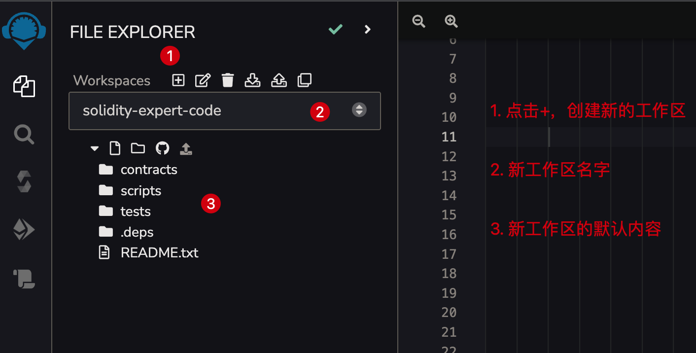

# 第8节：Remix教程

**Remix在线编译器**是最流行的合约开发工具，对于新入门的开发者，非常友好，我们前期直接使用remix进行学习，


## 常用功能

1. 代码提示，高亮
2. 实时编译报错
3. 通过虚拟开发环境，直接运行代码
4. 与钱包灵活交互，灵活切换不同区块链网络
5. 可以直接调试本地工程代码
6. 插件丰富（如verify代码、安全检查、单元测试等）


[点击进入](https://remix.ethereum.org/#optimize=false&runs=200&evmVersion=null&version=soljson-v0.8.7+commit.e28d00a7.js)

**其他IDE**

1. vsCode（这部分会在后续项目中介绍使用）
2. IDEA


## Helloworld

编写第一极简智能合约，在区块链上存储并且打印：Helloworld，代码如下：

```js
// SPDX-License-Identifier: MIT
// compiler version must be greater than or equal to 0.8.13 and less than 0.9.0
pragma solidity ^0.8.13;

contract HelloWorld {
    string public greet = "Hello World!";
}
```

- **SPDX-License-Identifier: MIT**：指定开源协议（可以忽略）
- **pragma solidity ^0.8.13;** ：指定编译器版本号：
  - 0.8是大版本，.13是小版本号；
  - ^表示向上兼容高版本编译器，即0.8.14也可以编译当前代码（但是0.9.0不可以）；
  - 更多的时候一般使用等于号（=）来指定明确的版本，以防后续编译器有bug。（示例：=0.8.13）。
- **contract**：是关键字，表示当前是一个合约，同级别的还有：interface、library、abstract，会陆续介绍；
- **HelloWorld**：是合约的名字，类似于我们C++中的类概念；
- **string public greet = "Hello World!"**：定义一个string类型的字符串greet，赋值为"Hello World!"，类型是public的。

## 部署

打开remix，创建新的工作区：




## 启动后台

```sh
npm install -g @remix-project/remixd

remixd -s <contract_folder>
```


## Vscode插件

- Ethereum Remix
- 其他


## 小结

加V入群：Adugii，公众号：阿杜在新加坡，一起抱团拥抱web3，下期见！


> 关于作者：国内第一批区块链布道者；2017年开始专注于区块链教育(btc, eth, fabric)，目前base新加坡，专注海外defi,dex,元宇宙等业务方向。
