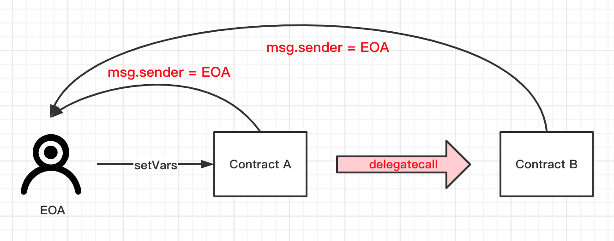

# 第9节: delegatecall

delegatecall与call相似，也是底层调用合约方式，特点是：

1. 当A合约使用delegatecall调用B合约的方法时，B合约的代码被执行，但是**使用的是A合约的上下文**，包括A合约的状态变量，msg.sender，msg.value等；
2. 使用delegatecall的前提是：A合约和B合约有相同的状态变量。



```js
// SPDX-License-Identifier: MIT
pragma solidity ^0.8.13;

contract B {
    // NOTE: storage layout must be the same as contract A
    uint public num;
    address public sender;
    uint public value;

    function setVars(uint _num) public payable {
        num = _num;
        sender = msg.sender;
        value = msg.value;
    }
}

// 注意：执行后，sender值为EOA的地址，而不是A合约的地址  (调用链EOA-> A::setVars -> B::setVars)
contract A {
    uint public num;
    address public sender;
    uint public value;

    function setVars(address _contract, uint _num) public payable {
        // A's storage is set, B is not modified.
        (bool success, bytes memory data) = _contract.delegatecall(
            abi.encodeWithSignature("setVars(uint256)", _num)
        );
    }
}
```

