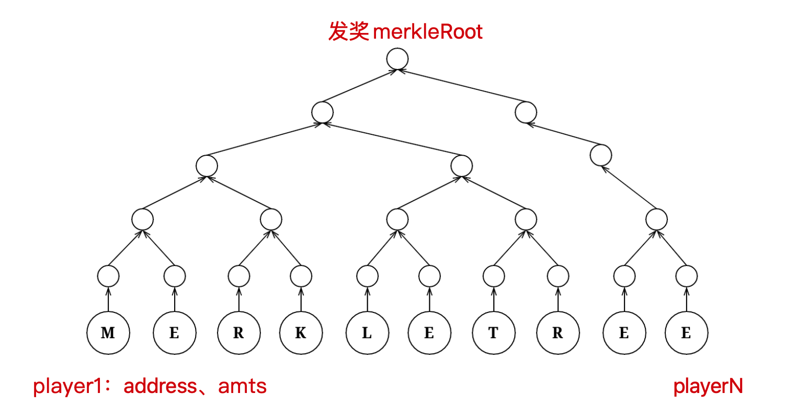
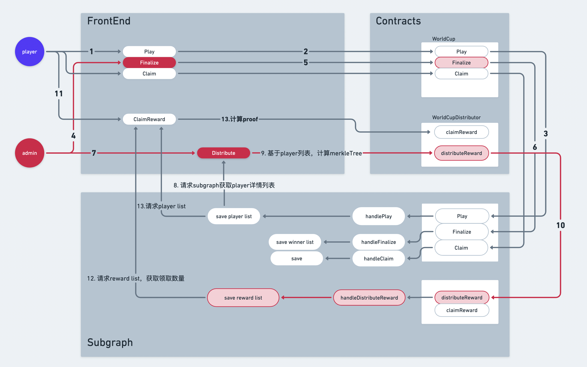
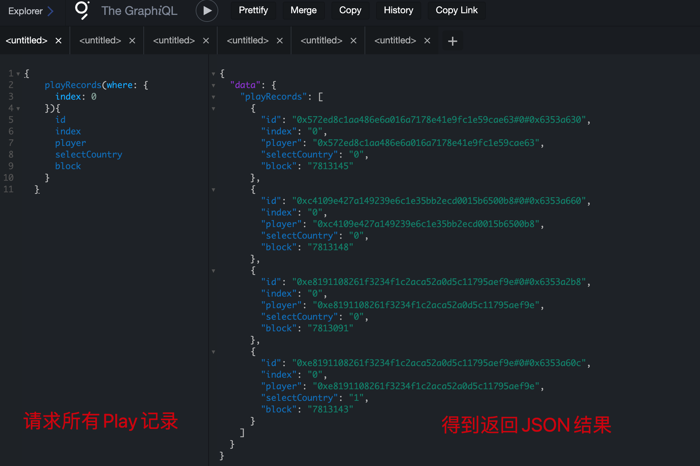
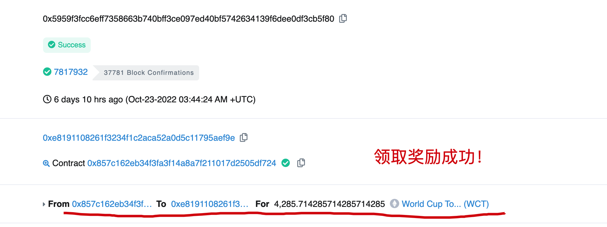

# 第5节：世界杯竞猜（发奖）

> 本文收录于我的开源项目：https://github.com/dukedaily/solidity-expert ，欢迎star转发，文末加V入群。


## 背景

| 玩家     | EOA地址                                    | 国家 | 备注     |
| -------- | ------------------------------------------ | ---- | -------- |
| 管理员   | 0xE8191108261f3234f1C2acA52a0D5C11795Aef9E |      | 负责开奖 |
| Account1 | 0xE8191108261f3234f1C2acA52a0D5C11795Aef9E | 0，1 |          |
| Account2 | 0xC4109e427A149239e6C1E35Bb2eCD0015B6500B8 | 0    |          |
| Account3 | 0x572ed8c1Aa486e6a016A7178E41e9Fc1E59CAe63 | 0    |          |

- 最终胜出国家：0，此时合约中一共有：4gwei，三个人平分：每个人获得 4/3 gwei，如果有剩余，则转给管理员。
- 合约地址：0x471a8f71d3bBB8254e36832FBbb6928b73298347


## 本节要做什么

- 发行一个worldCupToken
- 按照玩家的参与度进行分配，由subgraph进行链下统计
- 玩家自己进行领取奖励


## 技术选型

1. 使用链下签名方式，让用户链上claim：
   1. 需要为每个用户都生成一个链下的签名，由管理员签发；
   1. 好处是：分配时不需要调用合约；多期奖励可以一次领取；
   1. 代价是：需要入库，对后台要求更高
2. 使用merkle tree方式，对这一期所有的玩家进行统一设置，然后各自去claim：
   1. 好处是：不需要入库，直接设置一次merkleTree即可（由所有用户来当叶子节点）
   2. 代价是：需要调用一次合约；多期奖励无法一次领取，我们选用方法2


merkleRoot是一个hash值，每个节点是一个叶子（如M），根节点hash确定后，叶子节点和通向根节点路径中的hash值就都确定了，从而可以完成快速验证功能，能够满足我们的奖励方法需求。




## 奖励流程

奖励发放与领取逻辑介绍：

1. 管理员调用distribute（步骤7），这个方法的核心参数是MerkleRoot，是由所有玩家的“地址+奖励数量”作为叶子结点生成的。为了得到这些叶子结点，我们需要对subgraph发起请求玩家的原始数据（步骤8），然后根据奖励分配规则，在前端本地计算后每个人分配的数量，进而生成merkleRoot（步骤9），设置到合约中。
2. 存储MerkleRoot后发出事件，subgraph内部收到事件后，会在重复这个计算过程，并将计算结果存储在subgraph的db中（reward list）
3. 玩家发起领奖（步骤11）时，点击ClaimReward，此时需要的参数为：玩家、奖励数量、证明，用于在合约内部验证MerkleRoot。这些数据在上一步已经存储在subgraph中了，所以我们发起请求获取奖励列表（步骤12），在本地计算证明proof，然后传递给合约。
4. 合约接收到玩家领奖请求时，会将当前用户当成一个叶子节点，进而与已经设置好的merkleRoot进行验证。如果验证成功，则向用户转账奖励，反之合约revert。



原图：https://whimsical.com/Nfi7rAVqvYJd8mCLYHZYrx


## 部署合约

发放的Token：WorldCupToken：

```js
// SPDX-License-Identifier: MIT
pragma solidity ^0.8.9;

import "@openzeppelin/contracts/token/ERC20/ERC20.sol";

//合约继承，使用 is
contract WorldCupToken is ERC20 {
    // 2. 一次性mint出来，不允许后续mint
    constructor(
        string memory name_,
        string memory symbol_,
        uint256 totalSupply_
    ) ERC20(name_, symbol_) {
        _mint(msg.sender, totalSupply_);
    }
}
```

部署合约：

```sh
npx hardhat verify --contract contracts/tokens/WorldCupToken.sol:WorldCupToken  0x4c305227E762634CB7d3d9291e42b423eD45f1AD "World Cup Token" "WCT" 10000000000000000000000000 --network goerli

# 0x4c305227E762634CB7d3d9291e42b423eD45f1AD
```

奖励分发合约：WorldCupDistributor：

```js
// SPDX-License-Identifier: GPL-2.0-or-later
pragma solidity ^0.8.0;

import {IERC20} from "@openzeppelin/contracts/token/ERC20/IERC20.sol";
import "./libraries/MerkleProof.sol";
import './libraries/TransferHelper.sol';

/// @notice use for claim reward
contract WorldCupDistributor {
	  // 省略部分代码，详见代码仓库 ....
  
    function distributeReward(
        uint256 _index,
        uint256 _amount,
        uint256 _settleBlockNumber,
        bytes32 _merkleRoot
    ) external onlyOwner {
        merkleRoot = _merkleRoot;
        
        require(_index == merkleDistributors.length, "index already exists");
        uint256 currAmount = IERC20(token).balanceOf(address(this));
        require(currAmount >= _amount, "Insufficient reward funds");
        require(block.number >= _settleBlockNumber, "!blockNumber");
        // ...

        merkleDistributors.push(
            MerkleDistributor(_merkleRoot, _index, _amount, _settleBlockNumber)
        );

        emit DistributeReward(_merkleRoot, _index, _amount, _settleBlockNumber);
    }

    function claim(
        uint256 index,
        uint256 amount,
        bytes32[] calldata proof
    ) external {
        address user = msg.sender;
        require(merkleDistributors.length > index, "Invalid index");
        require(!isClaimed(index, user), "Drop already claimed.");

        MerkleDistributor storage merkleDistributor = merkleDistributors[index];
        require(merkleDistributor.amount >= amount, "Not sufficient");
        bytes32 leaf = keccak256(abi.encodePacked(index, user, amount));

        require(
          	// 核心校验逻辑
            MerkleProof.verify(proof, merkleDistributor.merkleRoot, leaf),
            "Invalid proof."
        );

        merkleDistributor.amount = merkleDistributor.amount - amount;
      	// 标识用户已经领取
        claimedState[index][user] = true;
      
      	// 向用户转账
        address(token).safeTransfer(msg.sender, amount);

        emit Claimed(address(this), user, amount);
    }
}
```

部署合约：

```sh
npx hardhat scripts/deployDistributor.ts --network goerli

# 0xF19233dFE30219F4D6200c02826B80e4347EF8BF

npx hardhat verify 0xF19233dFE30219F4D6200c02826B80e4347EF8BF 0x4c305227E762634CB7d3d9291e42b423eD45f1AD  --network goerli
```

部署后，我们需要手动向WorldCupDistributor中转入1w个奖励WorldCupToken，用于后续发放奖励。


## 编写配置文件

将下面内容添加到subgraph.yaml中，其中包含对WorldCup合约的监听，以及对发放奖励合约（WorldCupDistributor）的监听。

```yaml
specVersion: 0.0.4
schema:
  file: ./schema.graphql
dataSources:
  - kind: ethereum
    name: WorldCup
    network: goerli
    source:
    	# 监听世界杯主合约
      address: "0x0fd554503c88E9cE02D6f81799F928c8Aa202Dd3"
      abi: WorldCup
      startBlock: 7813068
			# ....
      abis:
        - name: WorldCup
          file: ./abis/WorldCup.json
      eventHandlers:
      	# 监听事件
        - event: Play(uint8,address,uint8)
          handler: handlePlay
        - event: Finialize(uint8,uint256)
          handler: handleFinialize
        - event: ClaimReward(address,uint256)
          handler: handleClaimReward
      file: ./src/world-cup.ts
  - kind: ethereum
    name: WorldCupDistributor
    network: goerli
    source:
	    # 监听奖励合约
      address: "0x857c162eB34f3FA3f14A8A7F211017D2505df724"
      abi: WorldCupDistributor
      startBlock: 7813265
      # ...
      abis:
        - name: WorldCupDistributor
          file: ./abis/WorldCupDistributor.json
      eventHandlers:
      	# 监听事件
        - event: DistributeReward(indexed bytes32,indexed uint256,uint256,uint256)
          handler: handleDistributeReward
        - event: Claimed(indexed address,indexed address,indexed uint256)
          handler: handleClaimed
      file: ./src/world-cup.ts

```

## 编写 Schema

schema.graphql，这些结构相当于数据库，用于在subgraph中存储计算后的数据。

```yaml
# 玩家Player详情
type PlayRecord @entity {
  id: ID!
  index: BigInt! # uint256
  player: Bytes! # address
  selectCountry: BigInt! # uint256
  time: BigInt!
  block: BigInt!
}

# 球队winner详情
type FinializeHistory @entity {
  id: ID!
  result: BigInt!
}

# 玩家奖励详情（分配后）
type PlayerDistribution @entity {
  id: ID!
  index: BigInt!
  player: Bytes!
  rewardAmt: BigInt!
  weight: BigInt!
  isClaimed: Boolean!
}

# 更多部分参见源代码....
```

## 编写映射文件

监听Play事件，将所有玩家详情记录下来。

```js
export function handlePlay(event: Play): void {
  // 统计所有的play事件，存储起来
  // 1. get id 
  let id = event.params._player.toHex() + "#" + event.params._currRound.toString() + "#" + event.block.timestamp.toHex();

  // 2. create entity
  let entity = new PlayRecord(id);

  // 3. set data
  entity.index = BigInt.fromI32(event.params._currRound);
  entity.player = event.params._player;
  entity.selectCountry = BigInt.fromI32(event.params._country);
  entity.time = event.block.timestamp;
  entity.block = event.block.number;

  // 4. save
  entity.save()

  // 5. save nohandle play record
  let noHandle = NeedToHandle.load(NO_HANDLE_ID);
  if (!noHandle) {
    noHandle = new NeedToHandle(NO_HANDLE_ID);
    noHandle.list = [];
  }

  // noHandle.list.push(id)
  let list = noHandle.list;
  list.push(id);
  noHandle.list = list;

  noHandle.save()
}

// 更多部分参见源代码....
```

监听最终结果事件Finalize

 ```js
 export function handleFinialize(event: Finialize): void {
   let id = event.params._currRound.toString();
   let entity = new FinializeHistory(id);
 
   entity.result = event.params._country;
   entity.save();
 }
 ```

监听奖励发放事件，进行计算：（核心逻辑）

 ```js
 export function handleDistributeReward(event: DistributeReward): void {
   // parse parameters first
   let id = event.params.index.toString();
   let rewardAmt = event.params.amount;
   let index = event.params.index;
   let settleBlockNumber = event.params.settleBlockNumber;
 
   // 找到当前发奖周期，查看哪个国家是winner
   let winCountry = FinializeHistory.load(id)
   if (!winCountry) {
     return;
   }
 
   let totalWeight = BigInt.fromI32(0)
   let rewardActuallyAmt = BigInt.fromI32(0) 
   let rewardHistoryList: string[] = []; // for history check usage
 
   let noHandle = NeedToHandle.load(NO_HANDLE_ID);
   if (noHandle) {
     let group = new TypedMap<Bytes, BigInt>();
     let currentList = noHandle.list; // current record
     let newList: string[] = []; // record won't be used this time
     log.warning("current list: ", currentList)
 
     for (let i = 0; i < currentList.length; i++) {
       // 每个玩家都会得到奖励，默认权重weight为1
       let playerWeight = BigInt.fromI32(1)
       let record = PlayRecord.load(currentList[i]) as PlayRecord;
 
       if (record.block > startBlock && record.block <= endBlock) {
         if (winCountry.result == record.selectCountry) {
 					// 如果当前用户猜中了，奖励翻倍（权重*2）
           playerWeight = playerWeight.times(BigInt.fromI32(2))
         }
 
         let prevWeight = group.get(record.player)
         if (!prevWeight) {
           prevWeight = BigInt.fromI32(0)
         }
 
         // 更新当前用户权重到内存中，供下面👇进行奖励分配
         group.set(record.player, prevWeight.plus(playerWeight));
         totalWeight = totalWeight.plus(playerWeight);
       } else {
         // 遍历所有的record，累加到player之上, block区间之外的，会添加到newList中
         newList.push(currentList[i]);
       }
     }
 
     // 便利所有的group，为每个人分配奖励数量，然后存储在UserDistribution中(供最终调用)
     for (let j = 0; j < group.entries.length; j++) {
       let player = group.entries[j].key;
       let weight = group.entries[j].value;
 
       let id = player.toString() + "#" + index.toString()
 
       log.warning("totalWeight: ", [totalWeight.toString()])
       let reward = rewardAmt.times(weight).div(totalWeight);
 
       let playerDistribution = new PlayerDistribution(id);
       playerDistribution.index = index;
       playerDistribution.player = player;
       playerDistribution.rewardAmt = reward;
       playerDistribution.weight = weight;
       playerDistribution.isClaimed = false;
       playerDistribution.save();
 
       rewardHistoryList.push(id);
       rewardActuallyAmt = rewardActuallyAmt.plus(reward);
     }
 
     noHandle.list = newList;
     noHandle.save();
   }
 }
 ```

## 启动subgraph

这部分我们在上一节已经介绍，按顺序执行即可。

```sh
# 启动graphnode
docker-compose up

# 创建并
npm run codegen
npm run build
npm run create-local
npm run deploy-local

# Deployed to http://localhost:8000/subgraphs/name/duke/worldcup/graphql
```

## 获取请求Play数据

启动subgraph后，需要安静等待一会儿，等待数据同步完成后，我们便可以查询，由于之前已经使用3个用户发起过四次Play操作，所以得到结果如下：

```sh
{
    playRecords(where: {
      index: 0
    }){
      id
      index
      player
      selectCountry
      block
    }
  }
```

结果：



## 获取冠军球队


## 发奖和领奖

至此，我们完成了对事件的监听，接下来要由管理员进行发奖，Player进行领奖，在合约项目中，直接运行脚本：contracts/scripts/distributeReward.ts，对第0期的所有玩家，发放10000 * 10^18 个奖励，读取数据，生成merkleRoot

 ```sh
npx hardhat run scripts/distributeReward.ts
 ```

返回：


管理员分配奖励：调用奖励合约distruibuteRward方法，tx：https://goerli.etherscan.io/tx/0xb710c3d5c23072574e128d748f712eb1d6df95d59d00a58c0978e66fc9e44ae1，注意此处要用到newRoot值，这个是根据所有玩家奖励数计算得到的，详见脚本。


用户领取奖励：调用奖励合约的claim方法，tx：https://goerli.etherscan.io/tx/0x5959f3fcc6eff7358663b740bff3ce097ed40bf5742634139f6dee0df3cb5f80，注意此处的amount是脚本中读取subgraph获取的，proof也是本地计算得出来的。


查看流水，发现领取奖励成功！




## 小结

至此，我们终于把奖励发放介绍完了，业务逻辑比较复杂，这是主流的方法奖励方式，接下来的课程中，我们将一起学习链下签名相关内容，并且引入个人中心，使用NFT作为用户头像。


---

加V入群：Adugii，公众号：[阿杜在新加坡](https://mp.weixin.qq.com/s/kjBUa2JHCbOI_2UKmZxjJQ)，一起抱团拥抱web3，下期见！


> 关于作者：国内第一批区块链布道者；2017年开始专注于区块链教育(btc, eth, fabric)，目前base新加坡，专注海外defi,dex,元宇宙等业务方向。
