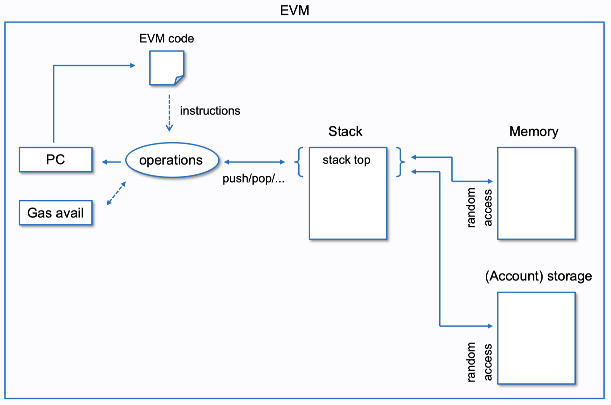
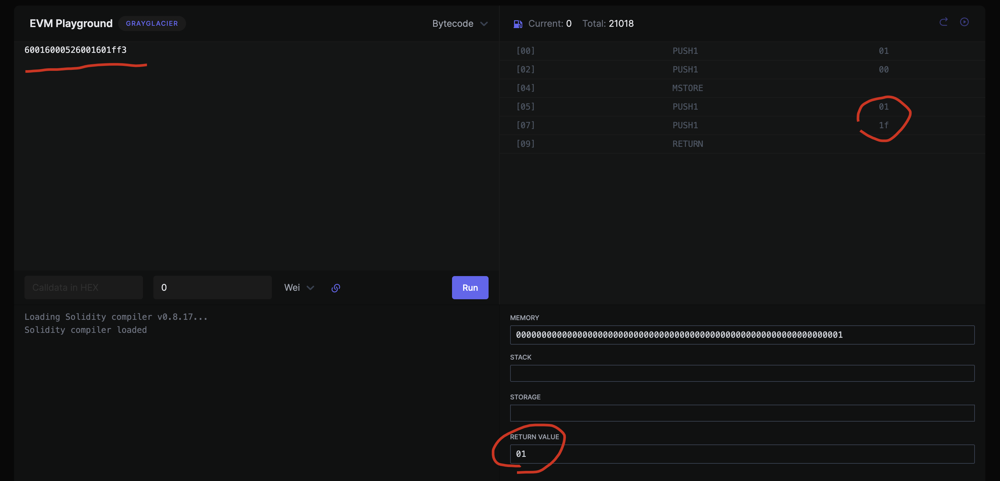

# 第8节：EVM-PUZZLE

> 本文收录于我的开源项目：https://github.com/dukedaily/solidity-expert ，欢迎star转发，文末加V入群。


以太坊在内部实现了一个基于栈的虚拟机，我们称之为EVM（Ethereum Virtual Machine），用户所有的操作最终都会转化为操作码（OPCODE）然后在EVM中执行，下图为整个执行流程，目前我们对EVM的讲解不多，后续会陆续补上。




本文将介绍10道EVM题目，每道题都会要求用户填写部分内容：使得程序正常退出，而不允许执行REVERT。

**注意：本文针对道是有EVM基础的同学，对于尚未接触过OPCODE的同学**，不要着急，在这里可以先看看EVM里面都有啥，有助于后续深入学习。


## 启动

**运行游戏**：https://github.com/fvictorio/evm-puzzles

```sh
npm i
npx hardhat play
```


## Puzzle#1：CALLVALUE

```sh
############
# Puzzle 1 #
############

00      34      CALLVALUE	#[msg.value]
01      56      JUMP	#跳转下一个evm字节，查看JUMPDEST，发现目的地是08，所以msg.value为8
02      FD      REVERT
03      FD      REVERT
04      FD      REVERT
05      FD      REVERT
06      FD      REVERT
07      FD      REVERT
08      5B      JUMPDEST
09      00      STOP

? Enter the value to send: 
```

- callvalue是输入的ether值，会存储到栈顶
- jump会读取栈顶值，并跳转到相应的字节地址，由JUMPDEST承接
- 由于目的地JUMPDEST是08，所以输入值为：8


## Puzzle#2：CODESIZE

```sh
############
# Puzzle 2 #
############

00      34      CALLVALUE	#[msg.value]
01      38      CODESIZE	#[10, msg.value]，codesize为当前evm中的操作码的数量，每一个是1字节
02      03      SUB	#[sub_result]， 需要跳转到06，所以 10 - msg.value = 6
03      56      JUMP
04      FD      REVERT
05      FD      REVERT
06      5B      JUMPDEST
07      00      STOP
08      FD      REVERT
09      FD      REVERT

? Enter the value to send: 
```

- CALLVALUE存储值到栈顶，STACK：[x]
- CODESIZE获取当前EVM环境中的操作码SIZE，每个OPCODE为1byte，我们此时内存中共10个操作码，因此执行CODESIZE后，会向栈顶存入10，STACK：[10, x]
- SUB会执行减法操作，并将结果如栈，STACK：[10 - x]
- JUMP会跳到06字节，因此我们需要 10 - x = 6，推导出：x = 4


## Puzzle#3：CALLDATASIZE

```sh
############
# Puzzle 3 #
############

00      36      CALLDATASIZE	#[datasize]
01      56      JUMP	#跳转到04，所以我们只要保证calldata到size为4即可，内容不限。
02      FD      REVERT
03      FD      REVERT
04      5B      JUMPDEST
05      00      STOP

? Enter the calldata: 0x11223344
```

- CALLDATASIZE返回INTPUT的字节数，并存入栈顶，STACK：[0x...]
- 为了JUMP到04，因此我们的输入需要大小为4字节，因此随便输入一个四字节data即可！


## Puzzle#4：XOR

```sh
############
# Puzzle 4 #
############

00      34      CALLVALUE	#[msg.value]
01      38      CODESIZE	#[12, msg.value]
02      18      XOR
03      56      JUMP
04      FD      REVERT
05      FD      REVERT
06      FD      REVERT
07      FD      REVERT
08      FD      REVERT
09      FD      REVERT
0A      5B      JUMPDEST
0B      00      STOP

? Enter the value to send: 
```

- CALLVALUE获取数值后入栈，STACK：[x]
- CODESIZE获取数值为12入栈，STACK：[12, x]
- 异或操作：
  - 12：0000，1100
  - 0A：0000，1010
  - x：   0000，0110 =》6，所以答案为：6


## Puzzle#5：JUMPI

```sh
############
# Puzzle 5 #
############

00      34          CALLVALUE	#[msg.value]
01      80          DUP1	#[msg.value, msg.value]
02      02          MUL	#[mul_result]
03      610100      PUSH2 0100	#[0100, mul_result]，反推mul_result为: 0100
06      14          EQ	#[0或1]，反推：1
07      600C        PUSH1 0C	#[0C, 0或1]，为了能跳转，此时必须为：1
09      57          JUMPI	#[]，stack2为1时，跳转到stack1的位置
0A      FD          REVERT
0B      FD          REVERT
0C      5B          JUMPDEST
0D      00          STOP
0E      FD          REVERT
0F      FD          REVERT

? Enter the value to send: (0)：
```

- CALLVALUE，STACK-> [x]
- DUP1：STACK-> [x，x]
- MUL：STACK-> [mul_result]
- PUSH2 0100：STACK-> [0100，mul_result]
- EQ：判断stack1和stack2是否相等，若相等，则清除这两个值，并向栈顶存入1，否则存入0
- PUSH1 0C：STACK-> [0C, 1]
- JUMPI：读取stack2的值，如果为1，则跳转到stack1的位置，即0C，满足条件！
- 因此我们需要使得：0100 = x*x，0x0100十进制为256，所以x = 16


## Puzzle#6：CALLDATALOAD

```sh
############
# Puzzle 6 #
############

00      6000      PUSH1 00	#[00]
02      35        CALLDATALOAD	#[calldata, 00]
03      56        JUMP	#跳转到0A，所以stack1为：0A
04      FD        REVERT
05      FD        REVERT
06      FD        REVERT
07      FD        REVERT
08      FD        REVERT
09      FD        REVERT
0A      5B        JUMPDEST
0B      00        STOP
```

- PUSH1 00，STACK：【0x00】
- CALLDATALOAD：获取input的数据，即calldata，参数为0x00，即从第00位置开始加载
- JUMP想跳转到0A处，所以calldata的值为0x0a，如果我们直接输入0x0a，此时会被转化为：a00000000000000000000000000000000000000000000000000000000000000，这是错的；
- 由于calldata的数值总为32字节的倍数，所以此处应该为：0x000000000000000000000000000000000000000000000000000000000000000a


## Puzzle#7：EXTCODESIZE

```sh
############
# Puzzle 7 #
############

00      36        CALLDATASIZE	# [datasize]
01      6000      PUSH1 00	# [00, datasize]
03      80        DUP1		# [00, 00, datasize]
04      37        CALLDATACOPY	# [] data被copy到memory中，栈被清空
05      36        CALLDATASIZE	# [datasize]
06      6000      PUSH1 00		# [00, datasize]
08      6000      PUSH1 00		# [00, 00, datasize]
0A      F0        CREATE	# [deployed_address] 栈被清空，从内存中读取数据，创建合约，返回地址 
0B      3B        EXTCODESIZE	# [address_code_size] 输入地址，返回合约的size
0C      6001      PUSH1 01	# [01, address_code_size]
0E      14        EQ	# [1] address_code_size必须为1，后续的才成立
0F      6013      PUSH1 13
11      57        JUMPI
12      FD        REVERT
13      5B        JUMPDEST
14      00        STOP
? Enter the calldata: 
```

- CREATE：三个参数（value，offset，size）
  - value是wei单位
  - offset是bytecode在内存中的起始位置
  - size是bytecode的size
- 注意⚠️：offset开始的bytecode是包含部署逻辑的数据，并非是新合约的bytecode，其返回值才是新合约的bytecode。
- 所以结果为：0x60**01**600052600160**1ff3**，[点击验证](https://www.evm.codes/playground?callValue=0&unit=Wei&codeType=Bytecode&code=%2760016000526001601ff3%27_&ref=hackernoon.com&fork=grayGlacier)




## Puzzle#8：SWAP

```sh
############
# Puzzle 8 #
############

00      36        CALLDATASIZE	# [datasize]
01      6000      PUSH1 00	# [00, datasize]
03      80        DUP1	# [00, 00, datasize]
04      37        CALLDATACOPY	# []  copy到内存中
05      36        CALLDATASIZE	# [datasize]，直接生成数据，不需要栈参数
06      6000      PUSH1 00	# [00, datasize]
08      6000      PUSH1 00	# [00, 00, datasize]
0A      F0        CREATE	# [deployed_address]
0B      6000      PUSH1 00	# [00, deployed_address]
0D      80        DUP1	# [00, 00, deployed_address]
0E      80        DUP1	# [00, 00, 00, deployed_address]
0F      80        DUP1	# [00, 00, 00, 00, deployed_address]
10      80        DUP1	# [00, 00, 00, 00, 00, deployed_address]
11      94        SWAP5	# [deployed_address, 00, 00, 00, 00, 00]，兑换1st 和 6th，你没有看错1和6，不是5
12      5A        GAS	# [gasAvail, deployed_address, 00, 00, 00, 00, 00] // 7个参数
13      F1        CALL	# [0或1]调用函数，需要是0，0表示失败，1表示成功！（反推的）
14      6000      PUSH1 00	# [00, 0或1]，需要是0
16      14        EQ	# [0或1]，需要是1
17      601B      PUSH1 1B	# [1B, 0或1]，需要是1
19      57        JUMPI						
1A      FD        REVERT
1B      5B        JUMPDEST
1C      00        STOP

? Enter the calldata:
```

- 我们需要做的是让call失败，一共要三种方式：
  - gas不足
  - 栈空间不足
  - 使用了STATICCALL但是value不为0，（注意，如果codesize是0，call方法是一直返回成功的）
- 我们需要传入数据，执行CRATE后返回的bytecode参与到后续的计算中，从而造成revert
- 具体做法为，根据Puzzle#8，我们传入：0x60016000526001601ff3，返回值为01，这个是OPCODE中的：ADD操作
- 调用CALL的时候，由于栈中的操作数已经不足（当前是0，ADD需要2个），因此会调用失败，REVERT。
- 因此答案为：0x60016000526001601ff3


## Puzzle#9：LT

```sh
############
# Puzzle 9 #
############

00      36        CALLDATASIZE	# [datasize]
01      6003      PUSH1 03	# [03, datasize]
03      10        LT	# [1], stack(1) < stack(2),
04      6009      PUSH1 09	# [09, 1]
06      57        JUMPI
07      FD        REVERT
08      FD        REVERT
09      5B        JUMPDEST	# [] 跳转到这里
0A      34        CALLVALUE		# [msgvalue]
0B      36        CALLDATASIZE	# [datasize, msgvalue]
0C      02        MUL		# [mul_result]
0D      6008      PUSH1 08	# [08, mul_result]
0F      14        EQ	# [1], 必须是0
10      6014      PUSH1 14	# [14, 1]
12      57        JUMPI
13      FD        REVERT
14      5B        JUMPDEST	# 跳转到这里，结束！
15      00        STOP

? Enter the value to send: 
? Enter the calldata: 
```

- mul_result应该是8
- datasize * msgvalue = 8
- 由于在03字节中， stack(1) < stack(2)，所以datasize大于3，且小于8
- 考虑到乘法，所以datasize应该为：4，msgvalue 为：2
- 因此答案为：
  - 2
  - 0xffffffff


## Puzzle#10：ISZERO

```sh
#############
# Puzzle 10 #
#############

00      38          CODESIZE	# [23]
01      34          CALLVALUE	# [msgvalue, 23]
02      90          SWAP1	# [23, msgvalue]
03      11          GT	# [1], msgvalue < 23
04      6008        PUSH1 08	# [08, 1]
06      57          JUMPI
07      FD          REVERT
08      5B          JUMPDEST	# 跳到这里
09      36          CALLDATASIZE	# [datasize]
0A      610003      PUSH2 0003	# [0003, datasize]
0D      90          SWAP1	# [datasize, 0003]
0E      06          MOD		# [N]，取余数，N为余数，必须是：0
0F      15          ISZERO	# [0或1]，必须是1
10      34          CALLVALUE	# [msgvalue, 0或1]，必须是：1
11      600A        PUSH1 0A	# [0A，msgvalue, 0或1]，反推：msgvalue = 0x0f
13      01          ADD	# [add_result, 0或1]，下面是跳转了，所以栈值为：[0x19, 1]
14      57          JUMPI
15      FD          REVERT
16      FD          REVERT
17      FD          REVERT
18      FD          REVERT
19      5B          JUMPDEST
1A      00          STOP
? Enter the value to send: 
? Enter the calldata: 
```

- ~~0A + msgvalue = 19，所以msgvalue为：9~~（这里犯错了，19是16进制的，我错误的当成了10进制相减了）。
- 0x19 - 0x0a = 0x0f，即十进制值：15
- calldata字段，需要满足size对3取余数为0即可，我们选择：0xffffff
- All puzzles are solved!


## 错误记录

1. push2：表示存入一个2字节的数据入栈，而不是入栈两次
2. Swap5：表示1st和6th兑换，而不是1st和5yh兑换
3. 1表示成功，0表示失败，JUMIPI和CALL都如此
4. OPCODE的字节序是16进制，而不是10进制，注意转化


## 小结

接下来会花几节课来讲解EVM相关内容，以及反汇编内容，敬请关注！


## 其他知识

- 答案：https://hackernoon.com/evm-puzzles-learn-ethereum-by-solving-interactive-puzzles
- 了解存储相关：https://www.evm.codes/about


---

加V入群：Adugii，公众号：[阿杜在新加坡](https://mp.weixin.qq.com/s/kjBUa2JHCbOI_2UKmZxjJQ)，一起抱团拥抱web3，下期见！


> 关于作者：国内第一批区块链布道者；2017年开始专注于区块链教育(btc, eth, fabric)，目前base新加坡，专注海外defi,dex,元宇宙等业务方向。
