# 一、项目地图

比特币是如何工作的，它用了哪些技术？


## 1. 交易是一切数据的来源

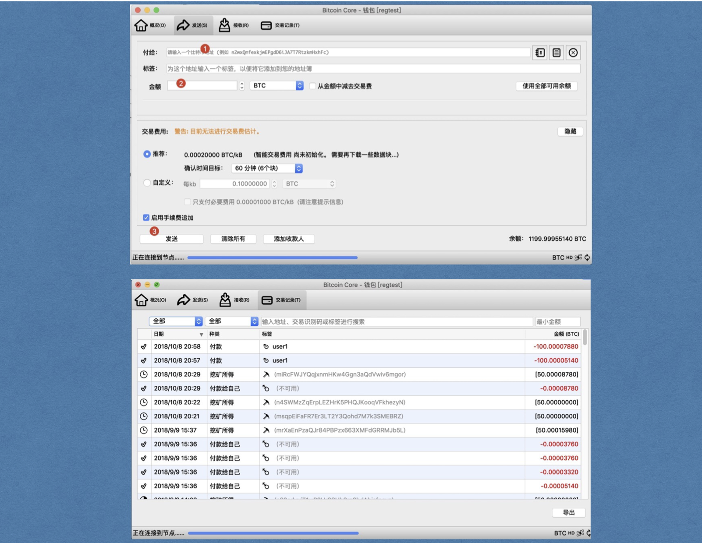

## 2. 交易流程

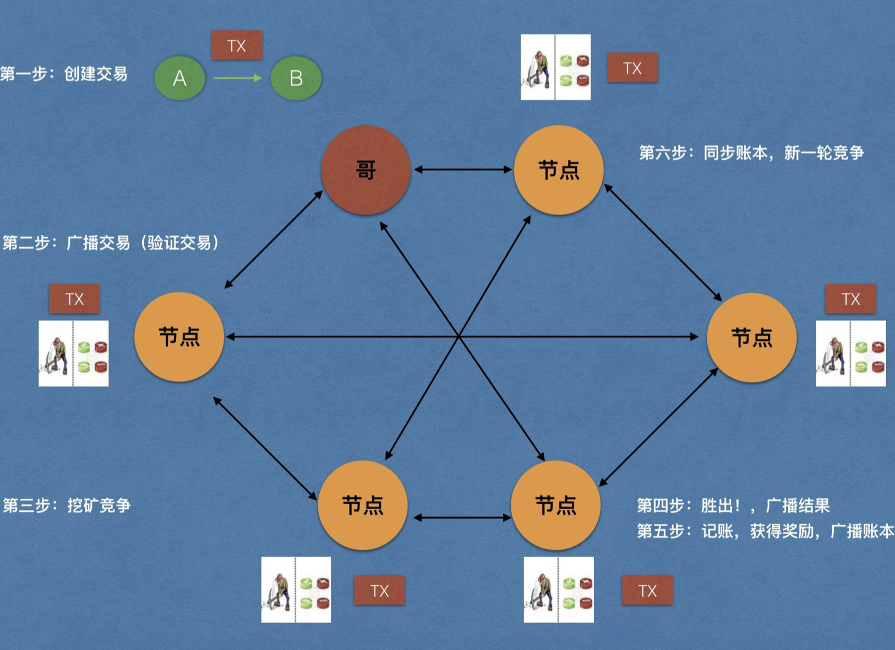

# 二、比特币用到了哪些技术

## 1. 概述

1. 密码学

2. P2P网络

3. 工作量证明
4. base58


# 三、密码学（保证交易安全）

## 1. 对称加密

### - 介绍

采用单钥密码系统的加密方法，同一个密钥可以同时用作信息的加密和解密，这种加密方法称为对称加密，也称为单密钥加密。

### - 算法

DES、3DES、AES、TDEA、Blowfish、RC2、RC4、RC5、IDEA、SKIPJACK。


### - 特点

* 加解密使用相同秘钥

* 高效，适用于大量数据的加密场景

* 算法公开，安全性取决于秘钥大小，但秘钥越大效率越低，需要权衡在安全和效率中做权衡
* 如果是被盗就没办法了（秘钥大难破解）


## 2. 非对称加密（交易验证）

### - 介绍

公钥私钥一一对应，公钥负责加密，对外公开，私钥用于加密和签名，仅自己持有，决不能外漏

### - 组成

* 公钥：加密，保护隐私
* 私钥：签名，1.保证数据来源，2.保证数据未被篡改， 3.签名人无法否认是自己签的

### - 公钥加密

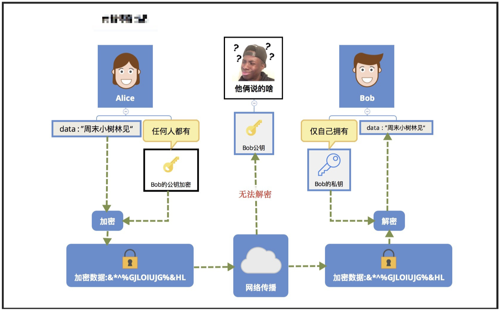


### - 私钥签名

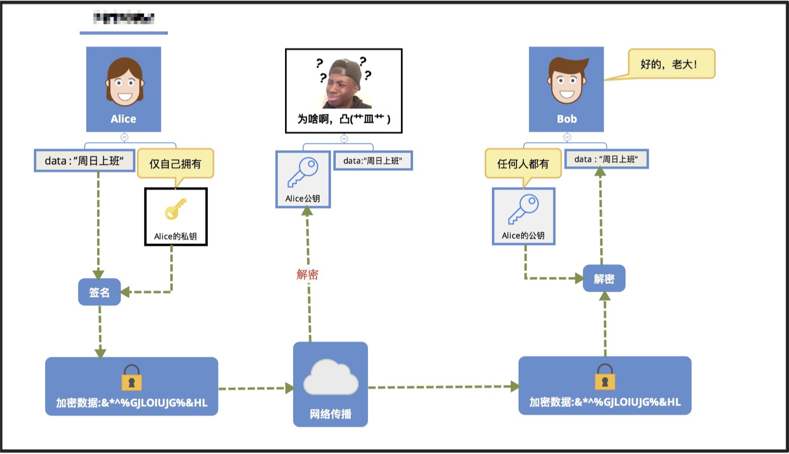


签名图示

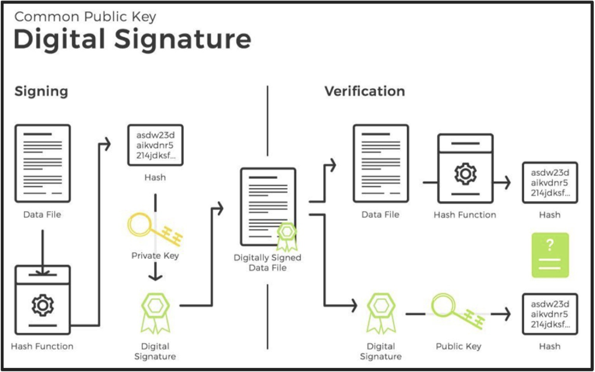

### - 特点

* 安全性高
* 加解密复杂，效率低

### - 算法

常用：RSA、ECC、Elgamal、背包算法、Rabin、D-H

* RSA[算法](https://open.163.com/movie/2012/10/1/C/M99VIFJA6_M9EDSHM1C.html)

* 椭圆曲线算法(ECC)(比特币，巧妙避开美国NSA后门，v神认为是巧合)

### - 应用

* [数字证书](http://www.blogjava.net/freeman1984/archive/2012/07/24/383817.html)
* 数字签名


### - 总结

* 对称加密加密与解密使用的是同样的密钥，所以速度快，但由于需要将密钥在网络传输，所以安全性不高。
* 非对称加密使用了一对密钥，公钥与私钥，所以安全性高，但加密与解密速度慢。
* 解决的办法是将对称加密的密钥使用非对称加密的公钥进行加密协商，然后发送出去，接收方使用私钥进行解密得到对称加密的密钥，然后双方可以使用对称加密来进行沟通。


# 四、P2P网络（广播交易，同步账本）

计算机网络的初衷就是建立一个相互通信的对等的计算机网络，但是由于历史问题连接在网络的计算机配置不高，计算能力和存储能力不足，因此相当长一段时间我们更倾向于使用基于客户端（client）和服务器（server）的C/S模式及浏览器（Browser）和服务器（server）的B/S模式。


而现代计算机的计算能力和配置都有了显著提高，建立去中心化的P（peer）2P（peer）对等网络，能很好的处理这种高并发数据处理，被广泛应用于文件下载和在线视频领域。

==了解即可==

## 1. 介绍

P2P(peer-to-peer):点对点技术，无中心服务器，依靠用户群交换信息的互联网体系。

网络的参与者共享他们所拥有的一部分硬件资源（处理能力、存储能力、网络连接能力、打印机等），这些共享资源通过网络提供服务和内容，能被其它对等节点（Peer）直接访问而无需经过中间实体。在此网络中的参与者既是资源、服务和内容的提供者（Server），又是资源、服务和内容的获取者（Client），P2P体系结构是应用层概念。

## 2. 图示

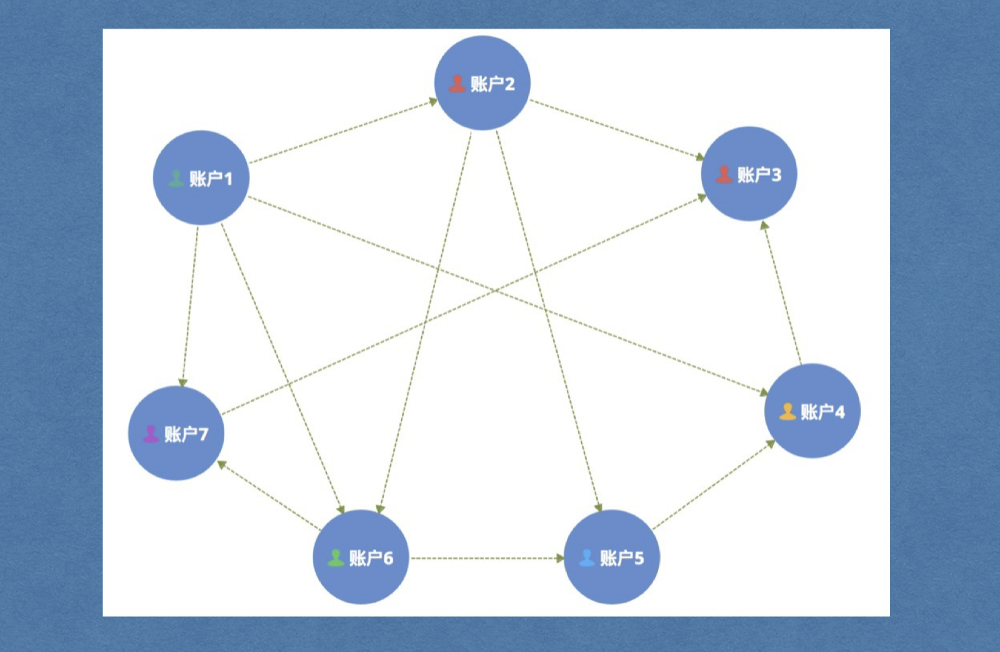

## 3. 特点

耐攻击、高容错、地位平等。

## 4. 应用

BT下载、电驴下载。


# 五、工作量证明（挖矿）

工作量证明（POW：Proof of work)是指出示结果表示你做过一件事情，获取结果的过程很曲折，验证却很简单。

==你出示计算得到随机数nonce，如果和你提供区块数据计算结果满足小于当前的难度值，那么系统就认为你做过一定量的计算工作。==


我们都说比特币挖矿是算一道题，那它算什么呢？**其实它就是对当前打包好的交易进行哈希sha256运算**，那哈希运算很简单啊，为什么说是难题呢？比特币的难题是要求矿工找一个特定的哈希值。我们都知道哈希运算的结果毫无规律可循，找一个明确的哈希是不现实的，我们要有难度，又要可行性，所以挖矿要求找一个比目标值小的哈希值即可。

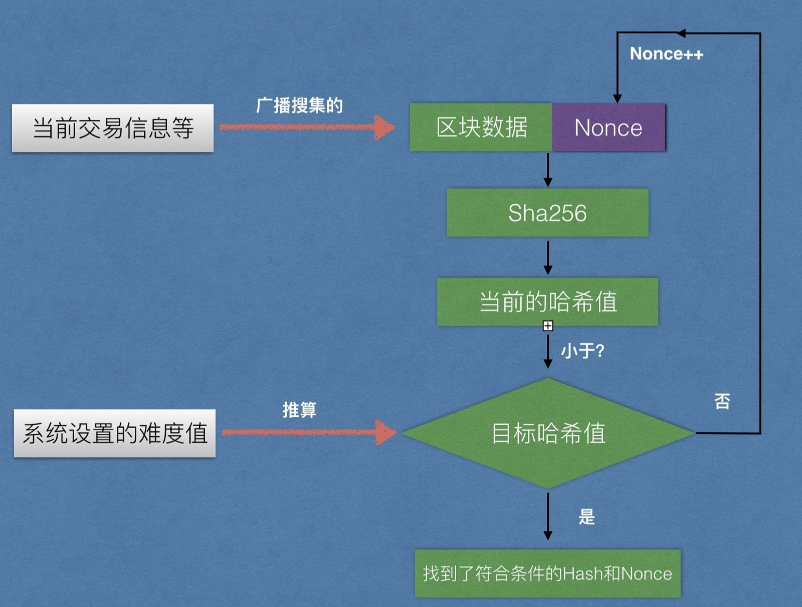

核心判断：


- 演示：https://anders.com/blockchain/blockchain.html
- 计算的时候同步搜集交易，上一个轮竞争结束后对搜集的交易进行打包，进行新一轮竞争（挖矿的时候不会加入新的交易）


浏览器截图：

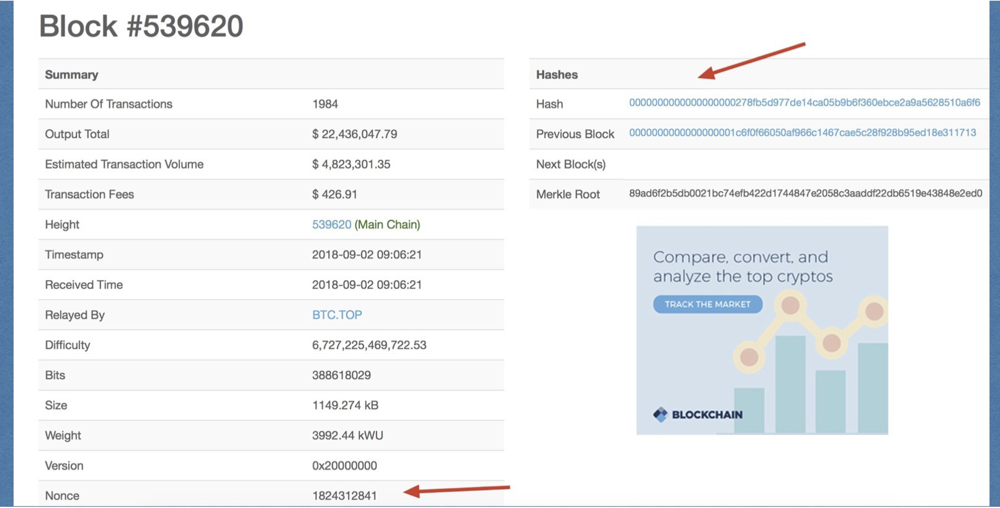

代码：

```js
import ( "crypto/sha256" "fmt" )

func main() {
  var data = "helloworld"

  //10s中左右
  for i := 0; i < 1000000; i++ {
  	hash := sha256.Sum256([]byte(data + string(i))) fmt.Printf("hash : %x, %d\n", string(hash[:]), i)
  }
}
```

看⼀下，前导0个数增加⼀个，i值的变化情况

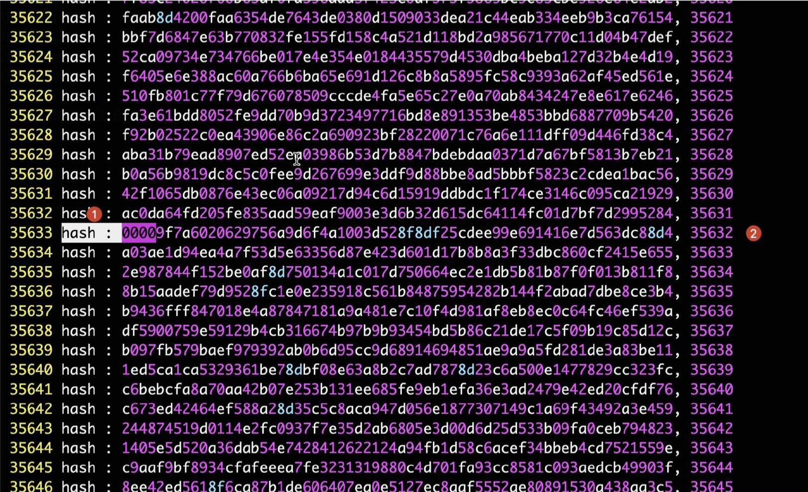


# 六、比特币地址生成

## 1. 地址规则

对随机字符串进行哈希，生成32字节的私钥


生成流程如下**（目前了解即可，v5版本会使用代码实现）**：

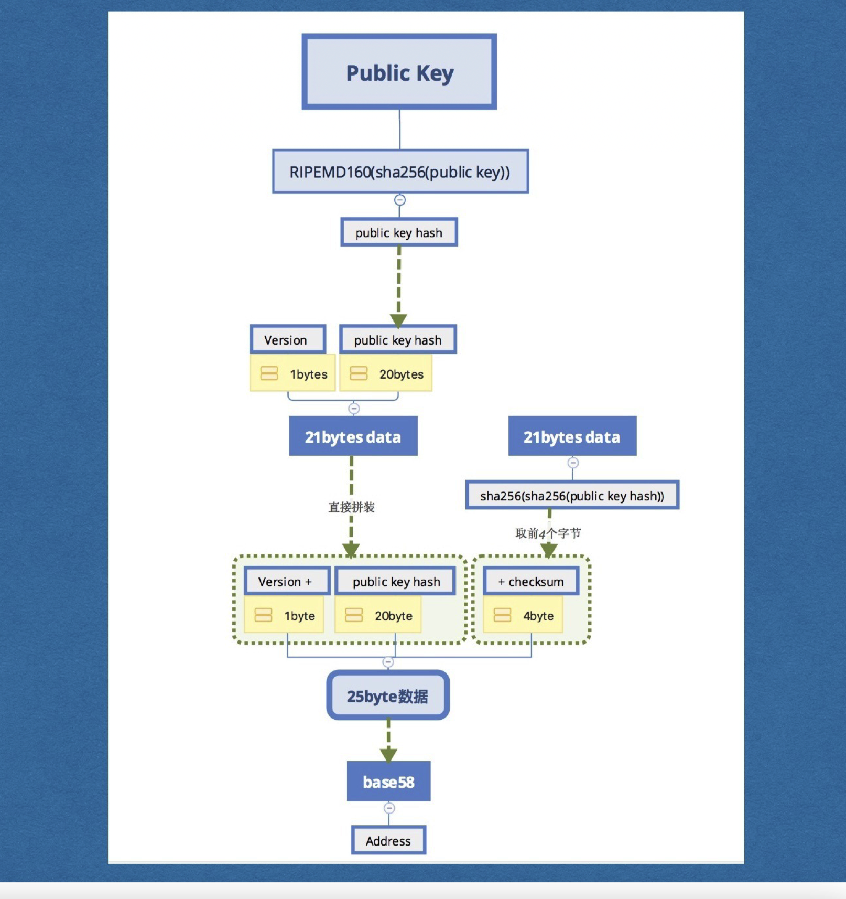

1. 地址可以校验
2. 比较短，可读
3. 每个地址前面有版本号，所以可以根据地址迅速判断是属于哪个网络的地址
   - 主网：0xx00   -> 1
   - 测试网：0x05  -> 3

## 2. 在线演示

==明确强调一下网站的作用==

[在线生成地址](http://gobittest.appspot.com/Address)（不可靠，只为了演示）

[BitCoinAddress](https://www.bitaddress.org/bitaddress.org-v3.3.0-SHA256-dec17c07685e1870960903d8f58090475b25af946fe95a734f88408cef4aa194.html)(相当有意思的地址，生成真实可用的地址)


# 七、编码（网络传输、生成地址）

## 1. Base64

（最开始不提理论，直接使用vi打开二进制文件，和编码过的文本，讲解文本化的概念）

（讲理论时，直接看Man的编码，然后解释为什么编码后变大了，引出编码规则）

### - 介绍

Base64编码，是我们程序开发中经常使用到的编码方法。因为base64编码的字符串，更适合不同平台、不同语言的传输（一个字符可能其他的系统没有）。它是一种基于用64个可打印字符来表示二进制数据的表示方法。它通常用作存储、传输一些二进制数据编码方法，一句：将二进制数据文本化（转成ASCII）。

### - 作用

由于某些系统中只能使用ASCII字符。Base64就是用来将非ASCII字符的数据转换成ASCII字符的一种方法。

### - [原理](https://blog.csdn.net/aozeahj/article/details/52507352)

Base64编码要求把3个8位字节（3\*8=24）转化为4个6位的字节（4*6=24），之后在6位的前面补两个0，形成8位一个字节的形式。 如果剩下的字符不足3个字节，则用0填充，输出字符使用'='，因此编码后输出的文本末尾可能会出现1或2个'=’。


为了保证所输出的编码位可读字符，Base64制定了一个编码表，以便进行统一转换。编码表的大小为2^6=64，这也是Base64名称的由来。

### - Base64编码表


恰好三个字节情况：


不足三个字节情况：

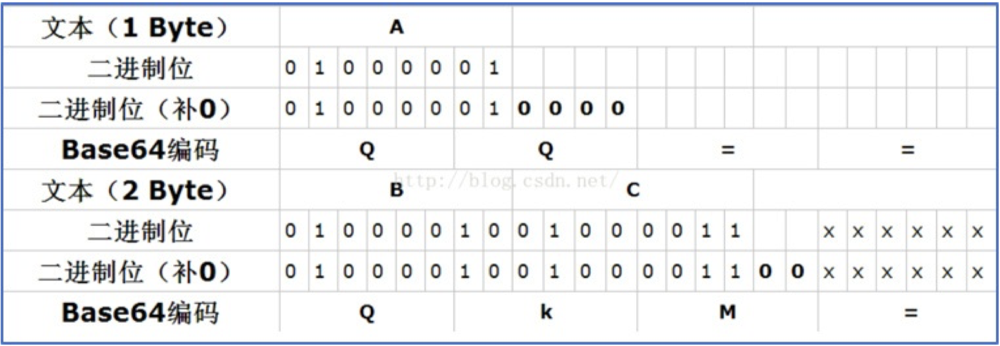


### - 特点

- base64就是一种基于64个可打印字符来表示二进制数据的方法。
- Z（26）、a-z（26）、0-9（10）、+/（2）：共计64个字符。
- 编码后便于传输，尤其是不可见字符或特殊字符，对端接收后解码即可复原。
- base64只是编码，并不具有加密作用。


### - 代码

```go
package main

import (
	"encoding/base64"
	"fmt"
	"log"
)

func main() {
	input := []byte("区块链学员中有一群神秘的大佬，他们家里有矿！")

	// 演示base64编码
	encodeString := base64.StdEncoding.EncodeToString(input)
	fmt.Println(encodeString)

	// 对上面的编码结果进行base64解码
	decodeBytes, err := base64.StdEncoding.DecodeString(encodeString)
	if err != nil {
		log.Fatalln(err)
	}
	fmt.Println(string(decodeBytes))

	fmt.Println()

	// 如果要用在url中，需要使用URLEncoding
	uEnc := base64.URLEncoding.EncodeToString([]byte(input))
	fmt.Println(uEnc)

	uDec, err := base64.URLEncoding.DecodeString(uEnc)
	if err != nil {
		log.Fatalln(err)
	}
	fmt.Println(string(uDec))
}
```


## 2. Base58（比特币生成地址）

在base64字符中去掉6种容易混淆的字符

- 0: number zero
- O: capital o
- l: lower L
- I: capital i
- +
- /


### - 为什么base58

使用了58个字符（一种Base58数字系统）和校验码，提高了可读性、避免歧义并有效防止了在地址转录和输入中产生 的错误。


# 八、总结

我们从交易环节出发，从大方向上介绍了比特币的运作流程及相关技术，但是各个环节到底在系统中具体如何运作的？接下来我们便带领诸位层层剖析，走到其内部结构。

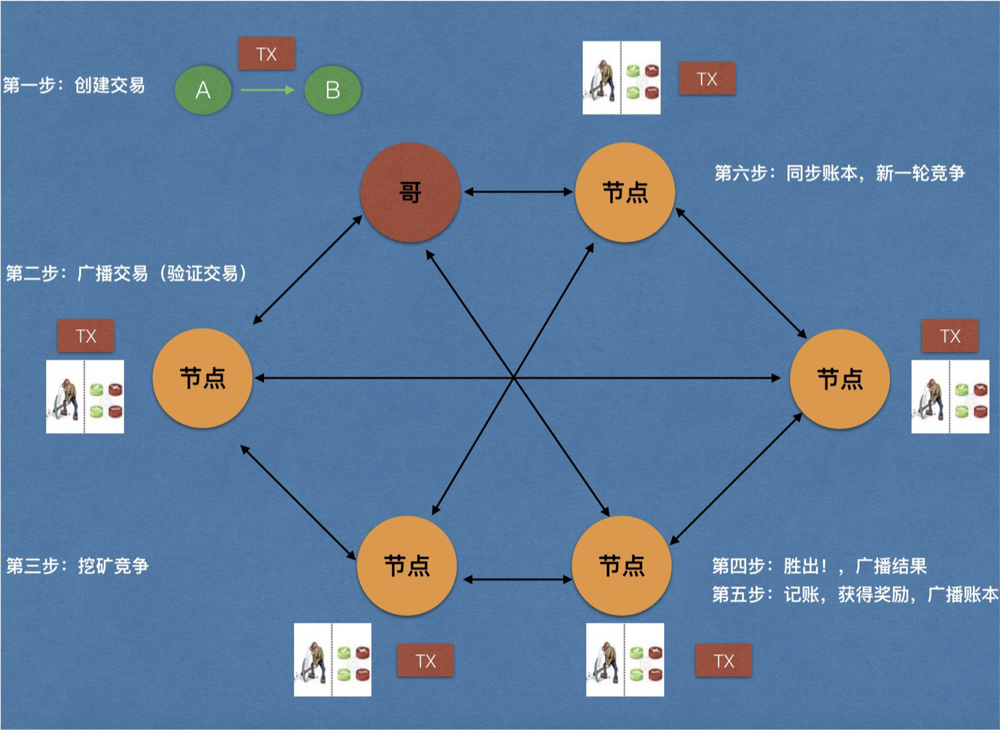