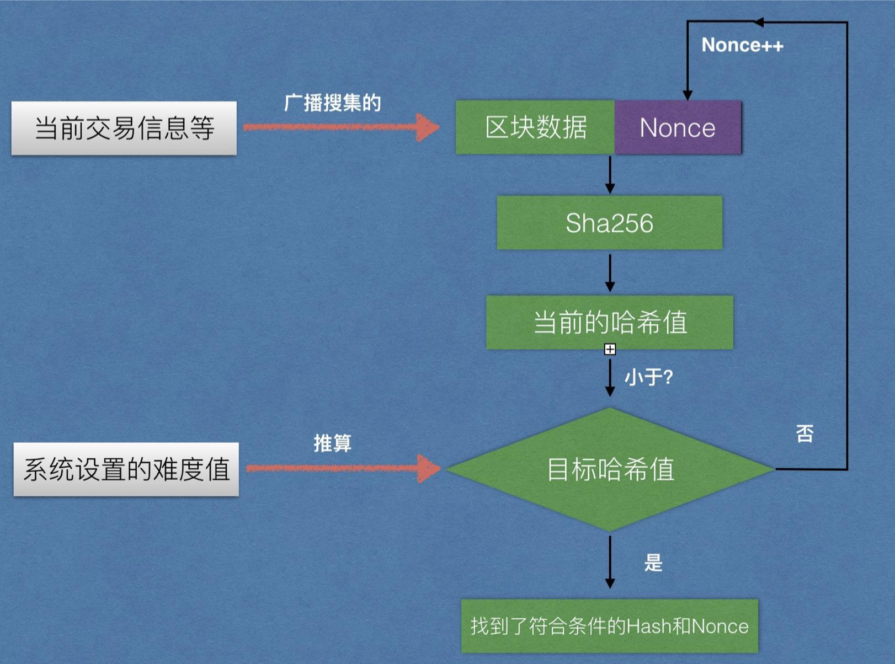
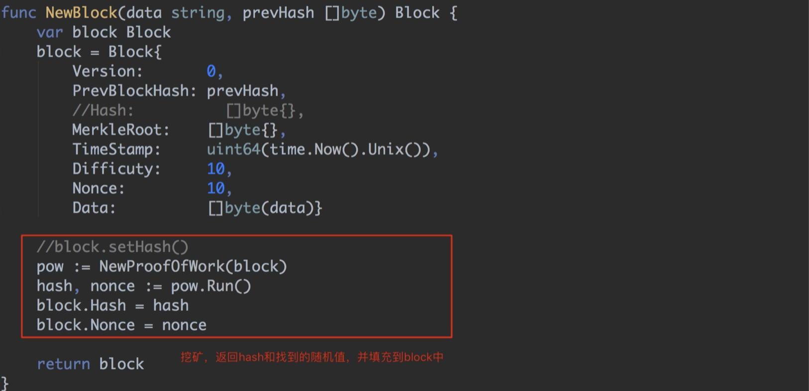
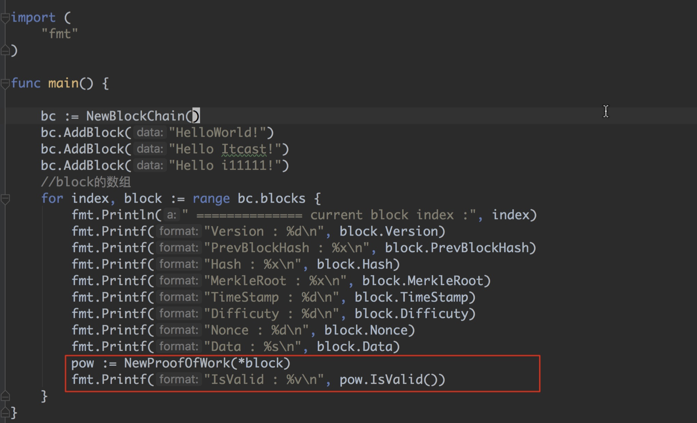
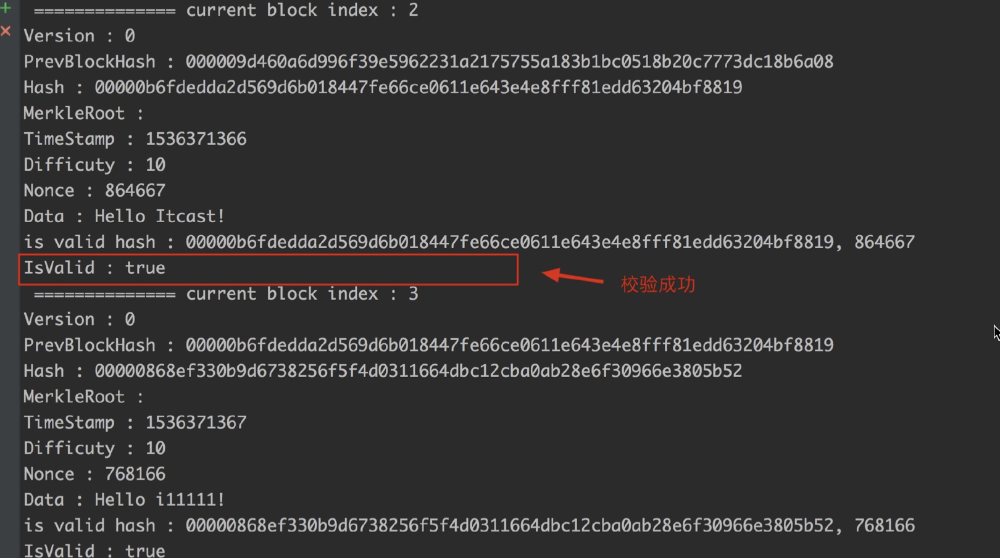

# 概述

## 1. 当前版本问题

* 随机数和难度值是随便填写的

* 区块的哈希值是无规则的


## 2. V2版本思路

- 定义一个工作量证明的结构ProofOfWork


- 提供创建POW的函数

- 提供计算不断计算hash的哈数

- 提供一个校验函数


# 一、工作量证明详细介绍


## 1. POW详细流程




## 2. 定义工作量证明结构

创建proofOfWork.go文件，添加如下代码：

```go
//- 定一个工作量证明的结构ProofOfWork
//- block
//- 目标值

type ProofOfWork struct {

	//区块数据
	block Block

	//目标值，先写成固定的值，后面再进行推到演算。
	target big.Int
}
```


## 3. 添加创建POW的函数

```go
//- 提供一个创建POW的方法
//NewProofOfWork(参数)

func NewProofOfWork(block Block)  *ProofOfWork{
	pow := ProofOfWork{
		block:block,
	}

	//自定义的难度值，先写成固定值
	//0000100000000000000000000000000000000000000000000000000000000000
	targetString := "0000100000000000000000000000000000000000000000000000000000000000"

    //不要连着写
	bigIntTmp := big.Int{}
	//bigIntTmp.SetBytes([]byte(targetString))
	bigIntTmp.SetString(targetString, 16)

	pow.target = bigIntTmp

	return &pow
}
```


## 4.添加挖矿的函数

```go
//- 提供一个计算哈希值的方法
//Run()
func (pow *ProofOfWork)Run() ([]byte, uint64) {

	//var data = "helloworld"
	////10s中左右
	//for i := 0; i < 1000000; i++ {
	//	hash := sha256.Sum256([]byte(data + string(i)))
	//	fmt.Printf("hash : %x, %d\n", string(hash[:]), i)
	//}
	var Nonce uint64
	var hash [32]byte

	fmt.Printf("target : %x\n", pow.target)
	for ;; {
		//[Size]byte
		hash = sha256.Sum256(pow.prepareData(Nonce))

		//比较：当前的哈希值[32]byte，目标值：big.Int

		//目标是：把当前的哈希值转换成big.Int
		tTmp := big.Int{}
		tTmp.SetBytes(hash[:])

		// Cmp compares x and y and returns:
		//
		//   -1 if x <  y
		//    0 if x == y
		//   +1 if x >  y
		//
		//func (x *Int) Cmp(y *Int) (r int) {
		//当前哈希.Cmp(目标值) == -1，说明当前的哈希小于目标值
		if tTmp.Cmp(&pow.target)  == -1 {

		//if tTmp < pow.target {
			//找到了，退出
			fmt.Printf("found hash : %x, %d\n", hash, Nonce)
			break
		} else {
			//继续循环
			Nonce++
		}
	}

	return hash[:], Nonce
}
```

## 5.实现辅助函数prepareData


这个函数类似于v1中的setHash函数的功能，代码如下：

```go
func (pow *ProofOfWork) prepareData(num uint64) []byte {
	block := pow.block
	tmp := [][]byte{
		uintToByte(block.Version),
		block.PrevBlockHash,
		//block.Hash,
		block.MerkleRoot,
		uintToByte(block.TimeStamp),
		uintToByte(block.Difficuty),
		uintToByte(num),
		block.Data}

	data := bytes.Join(tmp, []byte{})
	return data
}
```

# 二、调用POW

pow在block.go文件中使用，即创建完区块之后引入pow。将setHash()注释掉，使用ProofOfWork替换之。

代码如下：

​	

```go
	//block.setHash()
	pow := NewProofOfWork(block)
	hash, nonce := pow.Run()
	block.Hash = hash
	block.Nonce = nonce
```

具体位置如下：




# 三、第一次测试

## 1. main函数

主函数基于v1版本，无需修改:

```go
package main

import (
	"fmt"
)

func main() {

	bc := NewBlockChain()
	bc.AddBlock("HelloWorld!")
	bc.AddBlock("Hello Itcast!")
	bc.AddBlock("Hello i11111!")
	//block的数组
	for index, block := range bc.blocks {
		fmt.Println(" ============== current block index :", index)
		fmt.Printf("Version : %d\n", block.Version)
		fmt.Printf("PrevBlockHash : %x\n", block.PrevBlockHash)
		fmt.Printf("Hash : %x\n", block.Hash)
		fmt.Printf("MerkleRoot : %x\n", block.MerkleRoot)
		fmt.Printf("TimeStamp : %d\n", block.TimeStamp)
		fmt.Printf("Difficuty : %d\n", block.Difficuty)
		fmt.Printf("Nonce : %d\n", block.Nonce)
		fmt.Printf("Data : %s\n", block.Data)
	}
}
```

## 2. 编译执行

```
go build -o block *.go
./block
```

## 3.执行结果

```go
duke ~/Desktop/code/v2$  ./block 
target : f00000000000000000000000000000000000000000000000000000000000
found hash : 00001867d3549489218f6bd148c381da6396a398fae823d1b6b2eacd4fb5bb49, 77832
target : f00000000000000000000000000000000000000000000000000000000000
found hash : 00000f3a678ab02b58b9428e7eb3fd0e6cb374770b4192c640e2f4964f8120ec, 77018
target : f00000000000000000000000000000000000000000000000000000000000
found hash : 00000de185dc87751aa8c78638491e14548ff505473af89eb4954324b5539563, 80369
target : f00000000000000000000000000000000000000000000000000000000000
found hash : 00005acbe17bfbd374fbabe94ba6b64ba8cdfdedf828f02b21f14a4517dcffc3, 64729
 ============== current block index : 0
Version : 0
PrevBlockHash : 
Hash : 00001867d3549489218f6bd148c381da6396a398fae823d1b6b2eacd4fb5bb49
MerkleRoot : 
TimeStamp : 1536370652
Difficuty : 10
Nonce : 77832
Data : Genesis Block!
 ============== current block index : 1
Version : 0
PrevBlockHash : 00001867d3549489218f6bd148c381da6396a398fae823d1b6b2eacd4fb5bb49
Hash : 00000f3a678ab02b58b9428e7eb3fd0e6cb374770b4192c640e2f4964f8120ec
MerkleRoot : 
TimeStamp : 1536370652
Difficuty : 10
Nonce : 77018
Data : HelloWorld!
 ============== current block index : 2
Version : 0
PrevBlockHash : 00000f3a678ab02b58b9428e7eb3fd0e6cb374770b4192c640e2f4964f8120ec
Hash : 00000de185dc87751aa8c78638491e14548ff505473af89eb4954324b5539563
MerkleRoot : 
TimeStamp : 1536370652
Difficuty : 10
Nonce : 80369
Data : Hello Itcast!
 ============== current block index : 3
Version : 0
PrevBlockHash : 00000de185dc87751aa8c78638491e14548ff505473af89eb4954324b5539563
Hash : 00005acbe17bfbd374fbabe94ba6b64ba8cdfdedf828f02b21f14a4517dcffc3
MerkleRoot : 
TimeStamp : 1536370652
Difficuty : 10
Nonce : 64729
Data : Hello i11111!
 duke ~/Desktop/code/v2$  

```

图示：


# 四、添加校验函数

校验即对求出来的哈希和随机数进行验证，只需要对求出来的值进行反向的计算比较即可。

在ProofOfWork.go文件中，添加如下代码：

```go
//- 提供一个校验函数
//IsValid()

func (pow *ProofOfWork)IsValid()  bool{
	hash := sha256.Sum256(pow.prepareData(pow.block.Nonce))
	fmt.Printf("is valid hash : %x, %d\n", hash[:], pow.block.Nonce)

	tTmp := big.Int{}
	tTmp.SetBytes(hash[:])
	if tTmp.Cmp(&pow.target)  == -1 {
		return true
	}

	return false

	//return tTmp.Cmp(&pow.target)  == -1
}
```

在main.go文件中调用校验函数IsValid，添加如下代码：

```go
pow := NewProofOfWork(*block)
fmt.Printf("IsValid : %v\n", pow.IsValid())
```

位置如下：



# 五、第二次测试

重新编译执行，结果如下：



优化时间打印：

```js
timeFormat := time.Unix(int64(block.TimeStamp), 0).Format("2006-01-02 15:04:05")
fmt.Printf("时间戳: %s\n", timeFormat)
```


# 六、推导难度值

比特币系统并不是直接给定一个哈希值，而是给定一个难度数字，通过这个数字计算出一个哈希值，我们上面为了简化所以直接给定了一个哈希。现在，我们要模拟比特币模式，给定一个数字，然后推导出目标哈希值。

```go
func NewProofOfWork(block *Block) *ProofOfWork {
	pow := ProofOfWork{
		block: block,
	}

	//hashString := "0001000000000000000000000000000000000000000000000000000000000000"
	//tmp := big.Int{}
	//tmp.SetString(hashString, 16)

	//pow.target = &tmp

    //目标值：
	// 0001000000000000000000000000000000000000000000000000000000000000
    //初始值
	// 0000000000000000000000000000000000000000000000000000000000000001 
    //左移256位
	//10000000000000000000000000000000000000000000000000000000000000000
    //右移4位(16进制位数)
    // 0001000000000000000000000000000000000000000000000000000000000000

	targetLocal := big.NewInt(1)
	//targetLocal.Lsh(targetLocal, 256)
	//targetLocal.Rsh(targetLocal, difficulty)
	targetLocal.Lsh(targetLocal, 256-difficulty)
	pow.target = targetLocal

	return &pow
}
```


# 七、总结

这个版本我们详细讲解了pow工作证明的原理即实现方法，相信大家对挖矿的概念有了更深刻的了解。

由于我们没有讲到交易，所以目前没有实现奖励机制，后面会逐步引入，请继续学习后续课程。


# 八、下节预告

持久化 + 命令行

