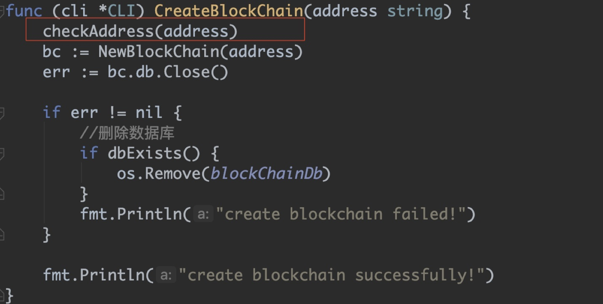

# 一、修改交易结构

## 1. TXInput

```go
type TXInput struct {
	//引用output所在交易ID
	TXID []byte

	//应用output的索引值
	VoutIndex int64

	//解锁脚本
	//ScriptSig string

	//签名
	Signature []byte
	//公钥
	PublicKey []byte
}
```

## 2. TXOutput

```go
type TXOutput struct {
	//接收的金额
	Value float64

	//锁定脚本
	//ScriptPubKey string
    
	//公钥哈希
	PublicKeyHash []byte
}
```

## 3.检查pubKeyHash是否可以解锁utxo

可以理解为解锁条件，真正的能解锁与否还要看后面的verify动作（稍后介绍）

```go
//解锁脚本
//存储在output中的其实是公钥的哈希，我们去锁定的时候也是输入地址，然后内部逆向算出哈希存储的
func (input *TXInput) CanUnlockUTXOWith(pubKeyHash []byte /*收款人的公钥哈希*/) bool {
	hash := HashPubKey(input.PublicKey)
	return bytes.Compare(hash, pubKeyHash) == 0
}
```

## 4.检查utxo是否可以被pubKeyHash解锁

3，4步两个函数是相对的，辅助功能，用于在遍历交易的时候进行过滤

```go
//检测是否被某个地址锁定
func (output *TXOutput) CanBeUnlockedWith(pubKeyHash []byte /*收款人的公钥哈希*/) bool {
	return bytes.Compare(output.PublicKeyHash, pubKeyHash) == 0
}
```

## 5.锁定脚本

之前的版本未涉及到锁定，在创建utxo的时候直接赋值为地址就算是锁定了，这里需要逆向求出来pubKeyHash，所以写了个锁定函数

```go
//锁定脚本
func (output *TXOutput) Lock(address string /*付款人的地址*/) {
	//先decode58
	pubKeyHash := Base58Decode([]byte(address))
	//去除掉version和checksum
	pubKeyHash = pubKeyHash[1:len(pubKeyHash)-4]
	//使用公钥哈希锁定该output
	output.PublicKeyHash = pubKeyHash
}
```

## 6.提供创建NewTXOutput函数

由于引入了Lock方法，无法像之前一样直接定义结构了，所以需要一个额外的函数。

```go
func NewTXOutput(value float64, address string) *TXOutput {
	txoutput := TXOutput{value, nil}
	txoutput.Lock(address)
	return &txoutput
}
```


# 二、调整代码

## 1.更新NewCoinbaseTX

1. TXInput的pubKey字段添加为矿工输入的数据
2. TXOutput使用NewTXOutput来代替

```go
func NewCoinbaseTX(address string, data string) *Transaction {
	...
	//比特币系统，对于这个input的id填0，对索引填0xffff，data由矿工填写，一般填所在矿池的名字
	input := TXInput{nil, -1, nil, []byte(data)}
	output := NewTXOutput(reward, address)

	txTmp := Transaction{nil, []TXInput{input}, []TXOutput{*output}}
	txTmp.setHash()

	return &txTmp
}
```

## 2.更新NewUTXOTransaction

我们创建新的交易一定是要使用钱包里面的公钥私钥，所以整个步骤如下：

1. 打开钱包，根据创建人的address找到对应的钱包（银行卡）
2. 查找可用的utxo，注意此时传递的不再是地址，而是地址的公钥哈希：pubKeyHash
3. 创建输入
4. 创建输出（付款，找零）
5. 使用私钥对交易进行签名


代码如下：

```go
func NewTransaction(from, to string, amount float64, bc *BlockChain) *Transaction {
	...
    //第一步：打开钱包，根据创建人的address找到对应的钱包（银行卡）
	//返回当前的钱包容器，加载到内存，注意，不会创建新的秘钥对
	ws, err := NewWallets()
	if err != nil {
		fmt.Println("no wallet.dat, will create one!")
	}
    
    wallet := ws.WalletsMap[from]
        
	if wallet == nil {
		fmt.Printf("本地没有 %s 的钱包，无法创建交易\n", from)
		return nil
	}

	privateKey := wallet.PrivateKey
	pubKey := wallet.PubKey

	pubKeyHash := HashPubKey(wallet.PublicKey)

    //第二步：查找可用的utxo，注意此时传递的不再是地址，而是地址的公钥哈希：pubKeyHash
	validUTXOs /*本次支付所需要的utxo的集合*/ , total /*返回utxos所包含的金额*/ = bc.FindSuitableUTXOs(pubKeyHash, amount)
    ...
    //第三步：创建输入
    //调整input的参数，签名填nil，后面会有签名函数负责填充
    input := TXInput{[]byte(txid), index, nil, wallet.PublicKey /*这里千万别错误的填哈希值，这是个坑啊！！*/}
	...
    //第四步：创建输出（付款，找零）
	//调用函数生成新的output
	output := NewTXOutput(amount, to)
	outputs = append(outputs, *output)

	if total > amount {
        //找零
		output = NewTXOutput(total-amount, from)
		outputs = append(outputs, *output)
	}
    
    //第五步：使用私钥对交易进行签名
    //TODO
}
```

**这是后就可以编译了，把FindSuitableUTXOs直接屏蔽掉**


## 3.更新FindSuitableUTXOs

```go
func (bc *BlockChain) FindUTXOTransactions(pubKeyHash []byte) [] Transaction {
    //将对应的address替换成pubKeyHash即可
}
```

同理更新FindSuitableUTXOs，FindUTXOs函数，同时修改GetBalance如下，将参数先设置为空，方便编译过

```go
func (cli *CLI)GetBalance(address string)  {
	...
	//utxos := bc.FindUTXOs(address)
	utxos := bc.FindUTXOs([]byte{})
}
```

## 4.编译测试

**编译通过即可(目前没法测试)**

## 5.获取余额

获取余额需要指定地址，通过遍历整个账本，从而找到这个地址可用的utxo，为此我们要做两件事：

1. **校验地址的有效性**

   传递过来的地址有可能是无效的，无效的地址直接返回即可。

2. **逆推出公钥哈希**

   并不是所有的地址都是本地生成的，有可能是别人的地址，所以我们需要逆推而不是打开钱包去查找。

3. **遍历账本**

   调用FindUTXOs函数

代码如下：

```go
func (cli *CLI) GetBalance(address string) {
	bc := GetBlockChainObj()
	defer bc.db.Close()

    //这里添加
	checkAddress(address)
	//这里修改
	pubKeyHash := Base58Decode([]byte(address))
	pubKeyHash = pubKeyHash[1: len(pubKeyHash)-addressCheckSumLen]

	utxos := bc.FindUTXOs(pubKeyHash)

	var total float64
	for _, utxo := range utxos {
		total += utxo.Value
	}

	fmt.Printf("The balance of %s is : %f\n", address, total)
}
```


## 6. 校验地址的有效性

```go
func isValidAddress(address string) bool {
	//1. 逆向求出pubKeyHash数据
	//2. 得到version + 哈希1 部分，并做checksum运算
	//3. 与实际checksum比较，如果相同，则地址有效，反之则无效

	pubKeyHash := Base58Decode([]byte(address))

	//防止输入的过短引起下面访问越界
	if len(pubKeyHash) < 4 {
		return false
	}

	payload := pubKeyHash[:len(pubKeyHash)-4]
	actualCheckSum := pubKeyHash[len(pubKeyHash)-4:]
	fmt.Printf("actualCheckSum : %x\n", actualCheckSum)

	targetCheckSum := checksum(payload)
	fmt.Printf("targetCheckSum : %x\n", targetCheckSum)

	return bytes.Compare(actualCheckSum, targetCheckSum) == 0
}
```

添加一个简单的校验函数，打印log

```go
func checkAddress(address string) {
	if !isValidAddress(address) {
		fmt.Println("not valid address :", address)
		os.Exit(1)
	}
	fmt.Println("valid address!")
}
```


## 6.创建区块链账本

这个函数已经实现，加上简单的地址校验即可(上面刚刚实现的)，其余的不用变



## 7.测试

### - 创建函数


### - 获取余额


## 8.小结

至此我们已经将真实的地址加入到程序中了。但是交易还没有签名和校验，下节介绍