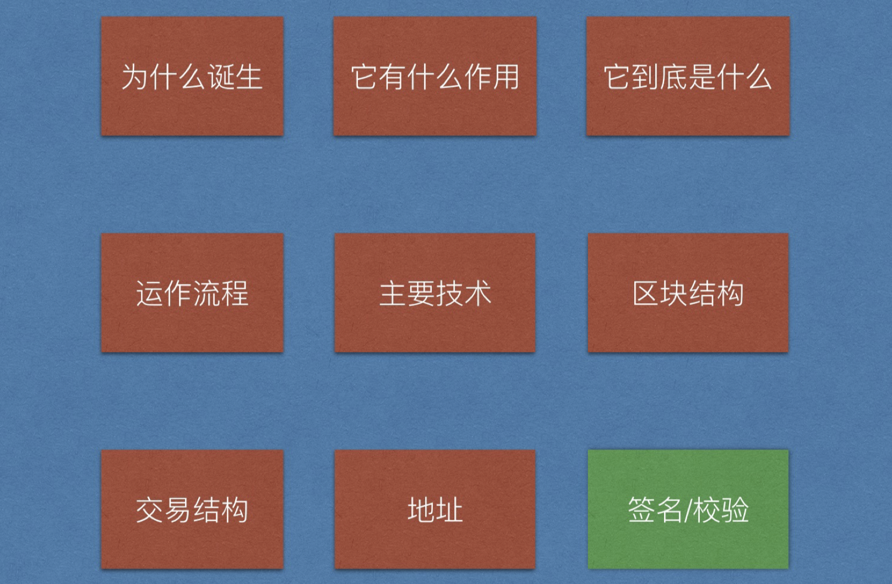
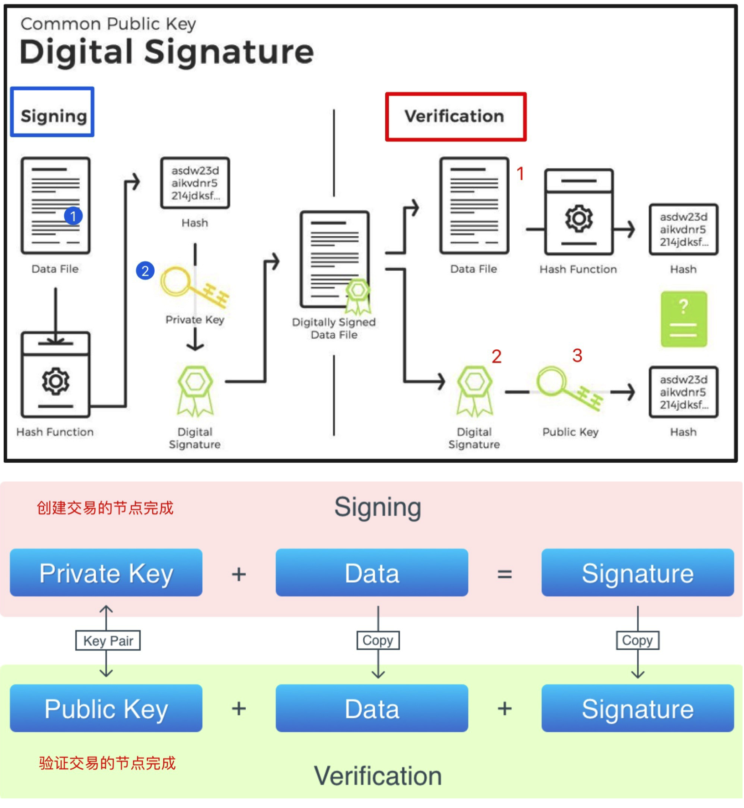
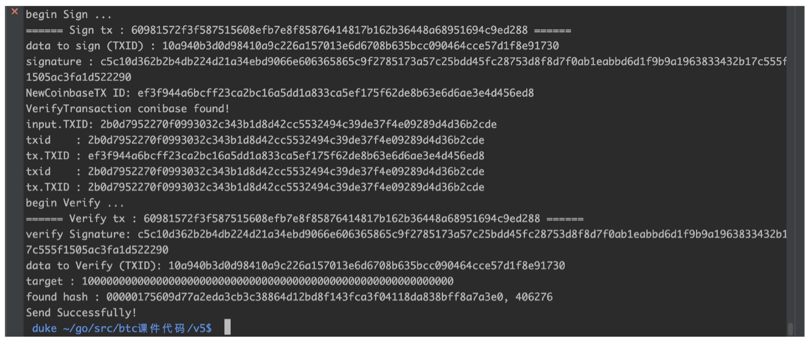
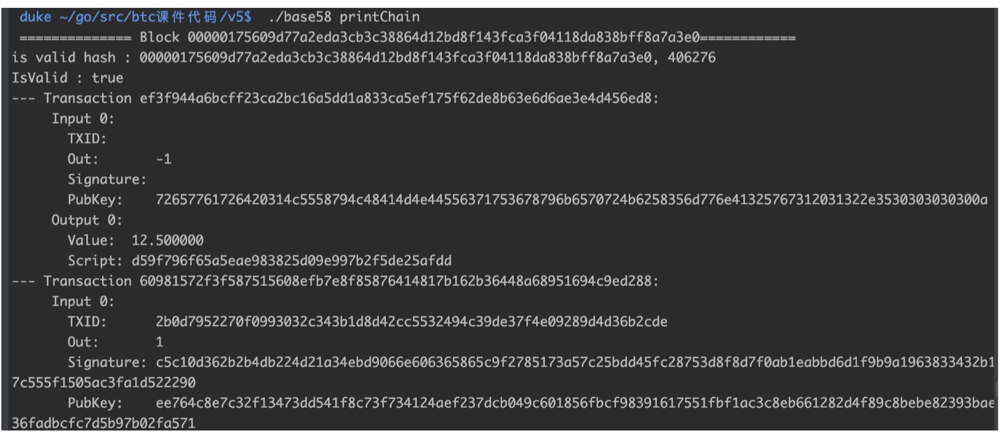

# 一、项目地图



# 二、数字签名

## 1. 图示



## 2. 需要签名的内容

### - 签名需要什么？

- 想要签名的数据
- 私钥


###  - 验证需要什么？

- 想要签名的数据
- 数字签名
- 公钥


### - 具体签哪些数据？

**所谓对交易签名**，就是对交易的哈希值签名，但是这个交易中要包含以下数据（注意，是包含以下内容，而不是仅限于以下信息）：

- 欲使用utxo中的pubKeyHash（这描述了付款人）
- 新生成utxo中的pubKeyHash（这描述了收款人）
- 转账金额


最后，把签好的数据放在每一个input的sig中，**由于每一笔交易都可能引用多个utxo（存在于多条交易中），所以我们要遍历所有的引用交易，并对它们逐个签名。**

**每个input的签名不同，虽然都是pubkeyHash，但是填充的位置不同，如：hello，h的位置变化，哈希值不同**

## 3. 在交易中签名

交易创建完成之后，在写入区块之前，我们要对其进行签名，这样对端才能够校验，从而保证系统的安全性。

为此我们需要在Transaction中添加签名(sign)和验证(verify)的方法。

### - sign

先把空函数写出来，Sign和SignTransaction，把关系交代清楚之后再进行内部实现

签名需要下面两个数据：

- 想要签名的数据
- 私钥


**无论是签名还是校验，一定要格外注意处理挖矿交易**

```go
func (tx *Transaction) Sign(privateKey ecdsa.PrivateKey, prevTXs map[string]Transaction) {
	fmt.Println("begin Sign ...")
	//挖矿交易不需要签名
	if tx.IsCoinbase() {
		return
	}

	fmt.Printf("====== Sign tx : %x ======\n", tx.TXID)

	//确保引用的交易都是有效的，tx中的每个input都应该对应一条交易
	for _, input := range tx.TXInputs {
		if prevTXs[string(input.TXID)].TXID == nil {
			//if prevTXs[hex.EncodeToString(input.TXID)].TXID == nil {
			log.Panic("Previous txs are not valid!")
		}
	}

	//获取要签名的信息
	//我们对把当前的交易签名，然后存放到Signature中。
	//将当前的交易复制一份，然后做签名处理
	txCopy := tx.TrimmedCopy()

    //再次强调一下我们要签名的三部分：
	//- 欲使用的utxo中的pubKeyHash（这描述了付款人）
	//- 新生成的utxo中的pubKeyHash（这描述了收款人）
	//- 转账金额

	//注意，遍历的是txCopy，而不是tx本身
	for index, input := range txCopy.TXInputs {
		prevTX := prevTXs[string(input.TXID)]

		//使用input的PublicKey字段暂时存储一下这个想要解锁的utxo的公钥哈希
		//这里有个坑！！！
		//我一直使用input.PublicKey来赋值，但是其实range会复制一个新的变量，而不会修改你遍历的的txCopy， 这里一定要小心！！！，所以下面的这就要修改如下：
		//input.PublicKey = prevTX.TXOutputs[input.VoutIndex].PublicKeyHash
		txCopy.TXInputs[index].PublicKey = prevTX.TXOutputs[input.VoutIndex].PublicKeyHash
		//至此三个想要签名的数据都有了, 如何签名？签名一般对数据的哈希值进行签名
		//要签名的哈希存放在txCopy.TXID中
		txCopy.setHash()
        //一定要赋值为nil，下面交易签名还要用的，虽然不用这个input了，但是它会污染其他交易
        //在校验过程时，也会生成txCopy，设置nil双方才能与生成一致的数据
        txCopy.TXInputs[index].PublicKey = nil
		fmt.Printf("data to sign (TXID) : %x\n", txCopy.TXID)

		r, s, err := ecdsa.Sign(rand.Reader, &privateKey, txCopy.TXID)
		if err != nil {
			fmt.Println("ecdsa.Sign failed!")
			log.Panic(err)
		}

    //将得到的r,s拼接成[]byte，放在signature中
		signature := append(r.Bytes(), s.Bytes()...)
		//tx的索引和txCopy的是一致的
		tx.TXInputs[index].Signature = signature
		fmt.Printf("signature : %x\n", signature)
	}
}

```

TrimmedCopy函数

```go
func (tx *Transaction) TrimmedCopy() Transaction {
	var inputs []TXInput
	var outputs []TXOutput

	for _, input := range tx.TXInputs {
		inputs = append(inputs, TXInput{input.TXID, input.VoutIndex, nil, nil})
	}

	for _, output := range tx.TXOutputs {
		outputs = append(outputs, TXOutput{output.Value, output.PublicKeyHash})
	}

	txCopy := Transaction{tx.TXID, inputs, outputs}
	return txCopy
}
```


在NewTransaction的最后，使用私钥对其进行签名。

签名函数由Transaction提供，但是签名动作由blockChain来实现，因为我们要遍历账本，

在SignTransaction内部再调用Sign函数。


### - SignTransaction

```go
func (bc *BlockChain) SignTransaction(tx *Transaction, privateKey ecdsa.PrivateKey) {
	//寻找所引用的交易数组
	//调用tx.Sign进行签名

	prevTXs := make(map[string]Transaction)
	for _, input := range tx.TXInputs {
		prevTX, err := bc.FindTransaction(input.TXID)
		if err != nil {
			log.Panic(err)
		}

    //这里一定要注意，不是tx.TXID，小心掉坑
		prevTXs[string(prevTX.TXID)] = prevTX
	}

	tx.Sign(privateKey, prevTXs)
}
```

### - FindTransaction

通过交易id返回交易结构

```go
func (bc *BlockChain) FindTransaction(txid []byte) (Transaction, error) {
	it := NewBlockChainIterator(bc)
	for {
		block := it.GetBlockAndMoveLeft()
		for _, tx := range block.Transactions {
			if bytes.Compare(txid, tx.TXID) == 0 {
				return *tx, nil
			}
		}

		if len(block.PrevBlockHash) == 0 {
			break
		}
	}

	return Transaction{}, errors.New("Transaction not found!")
}
```

### - 测试


## 4.在挖矿时校验

当一笔交易发送到对端时，接收方在打包到自己的区块前，需要先对交易进行校验，从而保证

1. 持有者花费的确实是自己的钱
2. 交易确实是由私钥的持有者发起的


### - 分析

校验函数(Verify)依然在Transaction结构中实现，需要三个数据：

- 想要签名的数据
- 数字签名
- 公钥

代码如下：

校验函数原型如下，由于交易中已经存储了`数字签名`和`公钥`，所以只需要将引用的交易传递进来即可（为了获取引用输出的公钥哈希）

```go
func (tx *Transaction) Verify(prevTXs map[string]Transaction) bool {
	return true
}
```

那这个交易由谁在何处调用呢？

答案是：我们要在挖矿之前进行验证，确保只有正确有效的交易才会被打包

```go
func (bc *BlockChain) AddBlock(txs []*Transaction) {
	...
	//创建新区块
	newBlock := NewBlock(txs, lastBlockHash)

	for _, tx := range txs {
		if !bc.VerifyTransaction(tx) {
			log.Panic("Error : invalid transaction found!")
		}
	}
    ...
}
```

交易函数很简单，同SignTransaction

```go
func (bc *BlockChain) VerifyTransaction(tx *Transaction) bool {
	//必须加上这句校验，否则在FindTranction中就会报错，因为coinbase所引用的input的id为nil
	if tx.IsCoinbase() {
		fmt.Println("VerifyTransaction conibase found!")
		return true
	}

	prevTXs := make(map[string]Transaction)

    for _, input := range tx.TXInputs {
		fmt.Printf("input.TXID: %x\n", input.TXID)
		prevTX, err := bc.FindTransaction(input.TXID)
		if err != nil {
			log.Panic(err)
		}

		prevTXs[string(prevTX.TXID)] = prevTX
		//fmt.Printf("string(prevTX.TXID): %x", string(prevTX.TXID))
	}

	return tx.Verify(prevTXs)
}
```

编译一下，没有问题，接下来实现Verify函数

### - Verify

```go
func (tx *Transaction) Verify(prevTXs map[string]Transaction) bool {
	fmt.Println("begin Verify ...")
	if tx.IsCoinbase() {
		return true
	}

	fmt.Printf("====== Verify tx : %x ======\n", tx.TXID)

	for _, input := range tx.TXInputs {
		if prevTXs[string(input.TXID)].TXID == nil {
			log.Panic("previous transaction is not valid!")
		}
	}

    //为了获取原始的签名数据
	txCopy := tx.TrimmedCopy()

	//获取签名的原始数据(一个哈希值)，与签名时步骤一样
	//签名时对每一个引用的input都签名，校验也一定是对每一个input都校验
	//这里要注意for循环的对象，应该是原始的inputs结构，而不应该是copy过来的那个
  //与Sign时遍历的不同	
	for index, input := range tx.TXInputs {
		prevTX := prevTXs[string(input.TXID)]
		//这个可以为了确保为空再设置一次nil
		txCopy.TXInputs[index].Signature = nil
		txCopy.TXInputs[index].PublicKey = prevTX.TXOutputs[input.VoutIndex].PublicKeyHash
		txCopy.setHash()
    
    //这个也可以再次置空，不过不需要，因为每一个index对应的input只使用一次(这是错误的理解)
    //之所尚未出错，因为我们现在都只引用一个交易就完成了，没校验多个input
    //一定要设置，否则会影响其他交易的校验
		txCopy.TXInputs[index].PublicKey = nil

		//处理签名
		r := big.Int{}
		s := big.Int{}

		sigLen := len(input.Signature)
        
    //查看签名的原始数据
    fmt.Printf("data to Verify (TXID): %x\n", txCopy.TXID)
		//确保签名是一致的
		fmt.Printf("verify Signature: %x\n", input.Signature)

		r.SetBytes(input.Signature[:(sigLen / 2)])
		s.SetBytes(input.Signature[(sigLen / 2):])

		//处理公钥
		x := big.Int{}
		y := big.Int{}
		keyLen := len(input.PublicKey)
		x.SetBytes(input.PublicKey[:(keyLen / 2)])
		y.SetBytes(input.PublicKey[(keyLen / 2):])

		curve := elliptic.P256()
		rawPubKey := ecdsa.PublicKey{curve, &x, &y}

		if !ecdsa.Verify(&rawPubKey, txCopy.TXID, &r, &s) {
			return false
		}
	}

	return true
}
```


### - 测试

发起一笔交易




# 三、打印命令

### - 结构体的String()

如果结构体实现了String()这个方法，那么fmt默认会调用String()。

```go
package main

import "fmt"

type Test struct {
	s string
}

func (t *Test) String() string{
	return fmt.Sprintf("hello world: %s\n", t.s)
}

func main() {
    n := Test{s:"你好"}
	fmt.Println(&n) //hello world:
}
```


### - 更新代码

```go
func (cli *CLI) printChain() {

	//定义迭代器
	//it := NewBlockChainIterator(cli.bc)
	bc := GetBlockChainObj()
	it := NewBlockChainIterator(bc)
	for {

		block := it.GetBlockAndMoveLeft()

		fmt.Printf(" ============== Block %x============\n", block.Hash)
		pow := NewProofOfWork(block)
		fmt.Printf("IsValid : %v\n", pow.IsValid())

		for _, tx := range block.Transactions {
			fmt.Println(tx)
		}

		if len(block.PrevBlockHash) == 0 {
			fmt.Println("print over!")
			break
		}
	}
}
```

在Transaction结构中，添加如下函数:

```go
func (tx Transaction) String() string {
	var lines []string

	lines = append(lines, fmt.Sprintf("--- Transaction %x:", tx.TXID))

	for i, input := range tx.TXInputs {

		lines = append(lines, fmt.Sprintf("     Input %d:", i))
		lines = append(lines, fmt.Sprintf("       TXID:      %x", input.TXID))
		lines = append(lines, fmt.Sprintf("       Out:       %d", input.VoutIndex))
		lines = append(lines, fmt.Sprintf("       Signature: %x", input.Signature))
		lines = append(lines, fmt.Sprintf("       PubKey:    %x", input.PublicKey))
	}

	for i, output := range tx.TXOutputs{
		lines = append(lines, fmt.Sprintf("     Output %d:", i))
		lines = append(lines, fmt.Sprintf("       Value:  %f", output.Value))
		lines = append(lines, fmt.Sprintf("       Script: %x", output.PublicKeyHash))
	}

	return strings.Join(lines, "\n")
}

```

### - 测试

与比特币核心类似




### - Transaction 添加String（）方法

```go
func (tx Transaction) String() string {
	var lines []string

	lines = append(lines, fmt.Sprintf("--- Transaction %x:", tx.TxId))

	for i, input := range tx.TXInputs {

		lines = append(lines, fmt.Sprintf("     Input %d:", i))
		lines = append(lines, fmt.Sprintf("       TXID:      %x", input.TXID))
		lines = append(lines, fmt.Sprintf("       Out:       %d", input.Index))
		lines = append(lines, fmt.Sprintf("       Signature: %x", input.Signature))
		lines = append(lines, fmt.Sprintf("       PubKey:    %x", input.PubKey))
	}

	for i, output := range tx.TXOutputs {
		lines = append(lines, fmt.Sprintf("     Output %d:", i))
		lines = append(lines, fmt.Sprintf("       Value:  %f", output.Value))
		lines = append(lines, fmt.Sprintf("       Script: %x", output.PubKeyHash))
	}

	return strings.Join(lines, "\n")
}
```


### - 增加printTx命令

```go
func (bc *BlockChain) PrintTx() {

	it := bc.NewIterator()

	for {
		block := it.Next()
		fmt.Printf("+++++++++++++++++++++++++++++++++++++\n")

		for _, tx := range block.Transactions {
			fmt.Printf("tx : %v\n", tx)
		}

		if len(block.PrevBlockHash) == 0 {
			break
		}

	}
}
```

